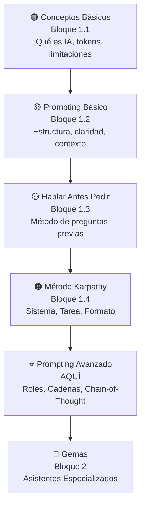

# 🎯 Sección 5: Prompting Avanzado
> **Objetivo de esta sección:**  
> Dominar técnicas avanzadas de prompting para extraer el máximo potencial de modelos de IA. Desde roles especializados hasta encadenamiento de tareas complejas.
---
## 📚 Documentos de Esta Sección
Esta sección contiene técnicas que van más allá del prompting básico. Los documentos están organizados de menor a mayor complejidad.
### 1. [01-Roles-Especializados.md](01-Roles-Especializados.md)
**Tema:** Cómo asignar un rol específico al modelo para mejorar respuestas  
**Duración:** 15 minutos  
**Dificultad:** 🟡 Intermedia
Aprenderás cómo transformar una respuesta genérica en una especializada asignándole un "rol" al modelo. Ejemplo: "Actúa como abogado administrativo" vs "Actúa como un funcionario de RR.HH."
---
### 2. [02-Formatos-Salida.md](02-Formatos-Salida.md)
**Tema:** Controlar exactamente el formato de las respuestas  
**Duración:** 15 minutos  
**Dificultad:** 🟡 Intermedia
Descubrirás cómo pedir al modelo que devuelva respuestas en formatos específicos: JSON, tablas, listas, párrafos estructurados, etc.
---
### 3. [03-Chain-of-Thought.md](03-Chain-of-Thought.md)
**Tema:** Pedir que el modelo "piense en voz alta"  
**Duración:** 20 minutos  
**Dificultad:** 🟡 Intermedia-Alta
Aprenderás la técnica "Chain of Thought" (CoT) que mejora significativamente la calidad de respuestas en tareas complejas. El modelo explicará su razonamiento paso a paso.
---
### 4. [04-Restricciones.md](04-Restricciones.md)
**Tema:** Cómo establecer límites y restricciones  
**Duración:** 15 minutos  
**Dificultad:** 🟡 Intermedia
Descubrirás cómo proteger tu prompt diciéndole al modelo qué NO debe hacer, qué datos proteger, y cómo validar seguridad.
---
### 5. [05-Cadenas-Tareas.md](05-Cadenas-Tareas.md)
**Tema:** Concatenar múltiples prompts para tareas complejas  
**Duración:** 20 minutos  
**Dificultad:** 🔴 Avanzada
Aprenderás a dividir tareas grandes en pasos manejables, encadenando prompts. Es el puente hacia agentes autónomos.
---
## 🎯 ¿Por qué Prompting Avanzado?
Al completar Bloque 1 hasta aquí, ya sabes:
- ✅ Qué es IA y cómo funciona
- ✅ Estructura básica de prompts
- ✅ Importancia de contexto y claridad
- ✅ Técnica "Hablar Antes de Pedir"
- ✅ Método Karpathy
**Ahora toca especializarte.** Esta sección te prepara para crear Gemas (Bloque 2), que es donde la IA se vuelve realmente productiva.
---
## 📊 Ruta de Aprendizaje

           ▼
---
  Gemas (Bloque 2)                   
 Asistentes especializados           
---
```
---
## 💡 Consejos Antes de Empezar
### ✅ Haz esto:
- Sigue los documentos en orden (1→5)
- **Prueba cada técnica con tus propios ejemplos**
- Compara resultados antes vs después
- Combina técnicas (rol + format + restricciones)
### ❌ Evita esto:
- Intentar aplicar todo simultáneamente
- Abrumar al modelo con demasiadas restricciones
- Confundir "restricción" con "censura"
- Pensar que hay una única respuesta correcta
---
## 🎁 Bonus: Tabla Comparativa Rápida
| Técnica | Cuándo Usarla | Impacto |
|---------|---------------|---------|
| **Roles** | Quieres especialización | Alto - cambia perspectiva |
| **Formatos** | Necesitas parseable automático | Medio - mejora usabilidad |
| **Chain-of-Thought** | Tarea compleja, razonamiento | Alto - mucho más preciso |
| **Restricciones** | Datos sensibles o seguridad | Crítico - protege |
| **Cadenas** | Tareas multi-paso | Alto - divide complejidad |
---
## 🚀 Después de Esta Sección
Habrás dominado **la mayoría de técnicas que los "prompt engineers" profesionales usan a diario.**
Estarás listo para:
- ✅ Crear Gemas profesionales (Bloque 2)
- ✅ Diseñar sistemas prompt sofisticados
- ✅ Entrenar a colegas en prompting
---
## 📌 Notas Importantes
> ⚠️ **La IA no es determinística**  
> A veces el mismo prompt da resultados diferentes. Esto es normal. Prueba varias veces si algo no sale como esperas.
> 💡 **Combina técnicas**  
> Las mejores respuestas vienen de combinar múltiples técnicas. Un rol + contexto + formato es más poderoso que cada uno solo.
> 🔒 **Seguridad primero**  
> En administración pública, siempre valida que el modelo no revele información sensible. Las restricciones son tu mejor amiga.
---
## 🎯 Comienza Aquí
👉 **[01-Roles-Especializados.md](01-Roles-Especializados.md)**
Dedícale ~1 hora a esta sección. Después, estarás listo para el siguiente nivel.
¡Adelante! 🚀

```