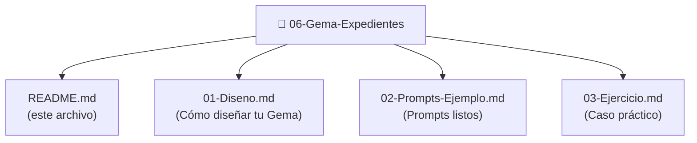

# Gema Expedientes: Tu Asistente en Gestión Administrativa

## ¿Qué es la Gema Expedientes?

La Gema Expedientes es un asistente especializado en **gestión y validación de expedientes administrativos**. Su propósito es convertir procesos complejos de documentación en tareas claras y verificables.

Imagina un compañero experto que:
- Revisa tu expediente y te dice exactamente qué documentos faltan
- Te alerta cuando un plazo se acerca a su fin
- Verifica que todo cumple normas sin lagunas
- Sugiere el siguiente paso en el procedimiento

Eso es la Gema Expedientes.

## Casos de uso reales

### Caso 1: Validación antes de enviar a tesorería
"Tengo un expediente de contratación. ¿Está completo para que tesorería lo apruebe?"

La Gema revisa documentación, verifica plazos, identifica lagunas.

### Caso 2: Búsqueda en expediente largo
"En este expediente de 50 páginas, ¿dónde está la evaluación de ofertas?"

La Gema localiza secciones clave sin necesidad de leer todo.

### Caso 3: Alerta de próximo paso
"Acabamos de recibir ofertas. ¿Cuál es el siguiente paso obligatorio?"

La Gema indica la acción inmediata según LOPA.

### Caso 4: Validación de excepción
"¿Es legal que solo tengamos 2 ofertas si publicamos en 3 canales?"

La Gema verifica normativa y condiciones de excepción.

### Caso 5: Seguimiento de plazos
"Publiqué hace 12 días. ¿Puedo cerrar la recepción de ofertas mañana?"

La Gema confirma cumplimiento del plazo mínimo.

## Diferencia entre Gema Expedientes y Gema Normativa

**Gema Normativa** (del Bloque anterior):
- Responde: "¿Qué dice la norma sobre X?"
- Enfoque: Información legal
- Aplicación: Consultas sobre regulaciones

**Gema Expedientes** (esta):
- Responde: "¿Qué necesita hacer este expediente?"
- Enfoque: Proceso y documentación
- Aplicación: Gestión operacional

Ambas son complementarias. La Normativa te dice qué es legal; la Expedientes te dice qué hacer.

## Funcionalidades clave

### 1. Validación de completitud
Verifica que expediente contiene toda documentación necesaria.

### 2. Identificación de lagunas
Especifica exactamente qué documentos faltan.

### 3. Alerta de plazos
Advierte cuando se aproximan vencimientos.

### 4. Verificación de proceso
Confirma que se siguieron pasos en orden correcto.

### 5. Recomendación de siguiente paso
Indica la próxima acción obligatoria.

### 6. Validación de excepciones
Verifica si un incumplimiento tiene justificación legal.

## Estructura de la Gema

### Qué encontrarás en cada sección

**01-Diseno.md:**
- Objetivo de la Gema
- Contexto especializado (LOPA, documentos, plazos)
- Capacidades y limitaciones
- Prompt del sistema listo para usar
- Ejercicio: cómo adaptar la Gema a tu caso

**02-Prompts-Ejemplo.md:**
- 6 prompts prácticos y listos
- Variantes para diferentes situaciones
- Cómo combinar prompts
- Ejercicio: crear tus propios prompts

**03-Ejercicio.md:**
- Caso de expediente real (contratación pública)
- Análisis paso a paso
- Solución guiada
- Reto avanzado para practicar

## Cómo usar esta Gema

### Opción A: Aprender y crear tu propia
1. Lee 01-Diseno.md
2. Personaliza el prompt a tu contexto
3. Prueba con 02-Prompts-Ejemplo.md
4. Valida con 03-Ejercicio.md

### Opción B: Usar los prompts directamente
1. Ve a 02-Prompts-Ejemplo.md
2. Copia un prompt
3. Úsalo en tu herramienta IA favorita
4. Adapta según resultados

### Opción C: Aprender haciendo
1. Salta a 03-Ejercicio.md
2. Lee el caso práctico
3. Intenta resolver antes de ver solución
4. Compara tu enfoque con el sugerido

## Resultados esperados

Después de completar esta Gema, podrás:

✅ Validar expedientes sin dejar documentación en el aire
✅ Identificar exactamente qué falta antes de problemas
✅ Responder "¿cuál es el siguiente paso?" en segundos
✅ Explicar a compañeros por qué un expediente no está listo
✅ Automatizar validaciones que hoy haces manualmente

## Próximos pasos

1. **Lee 01-Diseno.md** para entender la estructura
2. **Estudia los ejemplos** en 02-Prompts-Ejemplo.md
3. **Trabaja el caso práctico** en 03-Ejercicio.md
4. **Personaliza para tu caso** usando lo aprendido

---

**Tiempo estimado de aprendizaje:** 2-3 horas
**Dificultad:** Intermedia
**Requisito previo:** Haber completado Bloque 2 - Tu Primera Gema

¡Empecemos!
