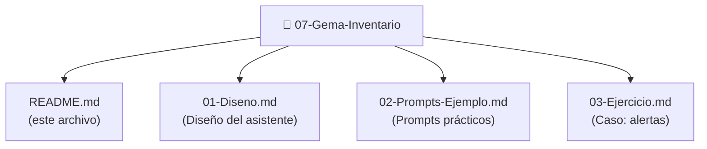

# Gema Inventario: Tu Asistente de Gestión de Activos

## ¿Qué es la Gema Inventario?

La Gema Inventario es un asistente especializado en **gestión de activos y recursos municipales**. Transforma tareas tediosas de inventariado en procesos inteligentes y automáticos.

Imagina tener alguien que:
- Sabe exactamente cuándo vence el seguro de cada vehículo
- Alerta cuando un equipo necesita mantenimiento
- Genera reportes de estado de inventario en segundos
- Valida si un activo puede ser dado de baja
- Rastrea dónde está cada cosa y quién la usa

Eso es la Gema Inventario.

## Casos de uso reales

### Caso 1: ¿Cuándo vence el seguro de este vehículo?
"Tengo un vehículo de la flota. ¿Cuándo vence el seguro? ¿Y la ITV?"

La Gema busca en registros y te alerta con plazo exacto.

### Caso 2: Mantenimiento preventivo
"¿Qué equipos informáticos necesitarán cambio en 2024?"

La Gema calcula vida útil y proyecta cambios necesarios.

### Caso 3: Auditoría de disponibilidad
"¿Qué equipos de oficina tenemos disponibles sin asignar?"

La Gema rastrea ubicación y responsabilidad.

### Caso 4: Baja de activos
"¿Podemos dar de baja estos 5 ordenadores? Tienen 6 años."

La Gema verifica procedimiento y autorización.

### Caso 5: Reporte de estado
"¿Cuál es el estado del inventario de vehículos?"

La Gema genera reporte con alertas de vencimientos.

## Diferencia entre esta Gema y otras

**Gema Normativa:** "¿Qué dice la ley sobre bienes públicos?"
**Gema Expedientes:** "¿Está completo el expediente de compra?"
**Gema Inventario:** "¿Este vehículo necesita mantenimiento YA?"

Es la más **operacional y urgente**. Los alertas de vencimiento no pueden esperar.

## Funcionalidades clave

### 1. Alertas de vencimiento
Seguro, ITV, mantenimiento, fin de vida útil.

### 2. Gestión de ciclo de vida
Alta → Uso → Mantenimiento → Baja.

### 3. Rastro de responsabilidad
Quién tiene qué, dónde, cuándo.

### 4. Proyección de necesidades
Qué cambios vienen próximamente.

### 5. Validación de baja
¿Puedo dar de baja esto? ¿Procedimiento correcto?

### 6. Reportes de estado
Dashboard de inventario con alertas.

## Estructura de la Gema

### Qué encontrarás en cada sección

**01-Diseno.md:**
- Objetivo especializado en inventario
- Contexto: categorías, ciclos, plazos
- Capacidades y limitaciones
- Prompt del sistema listo para usar

**02-Prompts-Ejemplo.md:**
- 5 prompts para casos comunes
- Variantes según contexto
- Cómo combinar para análisis completo

**03-Ejercicio.md:**
- Caso: Sistema de alertas automáticas
- Análisis de equipos y plazos
- Solución guiada

## Cómo usar esta Gema

### Ruta Rápida (30 minutos)
1. Salta a 02-Prompts-Ejemplo.md
2. Copia un prompt que necesites
3. Úsalo con tu inventario real

### Ruta Completa (2-3 horas)
1. Lee 01-Diseno.md
2. Personaliza el prompt
3. Prueba con 02-Prompts-Ejemplo.md
4. Aprende del caso en 03-Ejercicio.md

### Ruta Aprendizaje (1 hora)
1. Lee este README
2. Ve directamente a 03-Ejercicio.md
3. Intenta resolver antes de ver solución

## Resultados esperados

Después de esta Gema, podrás:

✅ Generar alertas automáticas de vencimientos
✅ Calcular cuándo cambiar cada equipo
✅ Validar bajas de activos correctamente
✅ Crear reportes de estado de inventario
✅ Automatizar seguimiento de mantenimiento

## Próximos pasos

1. **Lee 01-Diseno.md** para entender la estructura
2. **Explora ejemplos** en 02-Prompts-Ejemplo.md
3. **Trabaja el caso práctico** en 03-Ejercicio.md
4. **Personaliza para tu inventario real**

---

**Tiempo estimado:** 2-3 horas
**Dificultad:** Intermedia
**Caso de uso:** Auditoría y mantenimiento preventivo

¡Optimicemos tu inventario!
