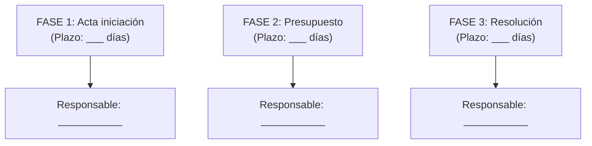
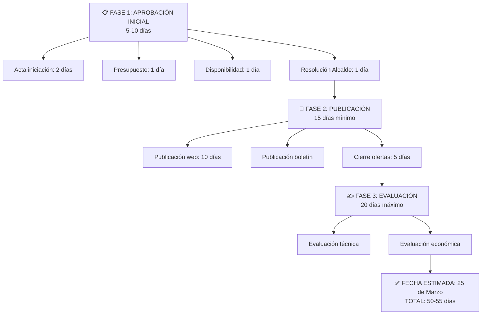

# Ejercicio: Procedimiento de Contratación Paso a Paso

## El Caso: Servicios de Consultoría en Modernización Digital

**Contexto:**
Eres responsable administrativo de la tramitación. El coordinador del proyecto (Jefa de Informática) solicita contratar servicios de consultoría. Debes guiar el procedimiento desde inicio hasta formalización.

La presión es real: el proyecto necesita empezar en abril, así que tienes que estar RÁPIDO pero CORRECTO.

## Parte 1: Análisis - Situación actual

Tu alcalde te llama: "Necesitamos contratar consultoría para transformación digital. ¿Cuándo podemos empezar la licitación?"

**Tú necesitas responder:**
1. ¿Cuál es el primer paso EXACTO?
2. ¿Quién debe hacer cada cosa?
3. ¿Cuánto tiempo llevará todo desde ahora?

### Información que tienes:

```
SOLICITUD INICIAL:
- Jefa de Informática requiere: Servicios de consultoría
- Importe estimado: 85.000€
- Justificación: Transformación digital municipal
- Urgencia: Quieren comenzar 1 de abril

PREGUNTAS A RESOLVER:
1. ¿Cuál es el PRIMER paso?
2. ¿Quién aprueba la solicitud inicial?
3. ¿Cuántos días tardará hasta poder publicar?
4. ¿Puedo acortar plazos si es urgente?
5. ¿Cuándo podría estar adjudicado?
6. ¿Cuándo podría firmar el contrato?
7. ¿Quién es responsable de cada fase?
```

## Parte 2: Tu Análisis

Antes de ver la solución, intenta planificar:

### Pregunta 1: Primer paso
¿Cuál es el primer paso OBLIGATORIO que debemos dar?

```
Mi respuesta: _________________________________
```

### Pregunta 2: Plan de fases

Planifica las fases del procedimiento con plazos:



### Pregunta 3: Plazo total
¿Cuándo podríamos tener el contrato firmado?

```
Si empezamos hoy: _____________ (fecha)
Si hay retrasos: _____________ (fecha pesimista)
```

---

## Solución Guiada

<details>
<summary>📋 Ver análisis completo del procedimiento</summary>

### RESPUESTA 1: Primer paso OBLIGATORIO

✅ **Primer paso: Acta de Iniciación**

ANTES que nada:
1. **Acta de iniciación** (describe qué necesitamos)
   - Redacta Jefa de Informática
   - Justifica la necesidad
   - Especifica qué queremos lograr

2. **Presupuesto detallado**
   - Desglose de partidas (diagnóstico, plan, implementación)
   - Justificación de importe

3. **Informe de disponibilidad presupuestaria**
   - Lo solicita al interventor o tesorería
   - Confirma que tenemos dinero

4. **Resolución de Aprobación**
   - La firma el Alcalde (o delegado autorizado)
   - Autoriza el gasto

**TODO ESTO debe estar completo ANTES de publicar.**

### RESPUESTA 2: Plan de fases con plazos



FECHA ESTIMADA: Publicar 26/03, cerrar 10/04

---

FASE 3: RECEPCIÓN OFERTAS (Variable, 5 días típico)
├─ Registro de entrada de cada oferta
├─ Verificación de cumplimiento formal
└─ Acta de recepción
Responsable: Oficina de Contratación
Plazo: Hasta cierre de plazo

FECHA ESTIMADA: Cierre 10/04, registro 10/04

---

FASE 4: EVALUACIÓN (20 días máximo)
├─ Evaluación técnica (por comisión)
├─ Evaluación económica
├─ Acta conjunta de evaluación
└─ Propuesta de adjudicación
Responsable: Comisión evaluadora (3 miembros mín.)
Plazo: máximo 20 días hábiles desde cierre

FECHA ESTIMADA: Comienza 11/04, finaliza 5/05

---

FASE 5: ADJUDICACIÓN (5-10 días)
├─ Resolución de adjudicación (firma Alcalde)
├─ Notificación a proveedores
├─ Plazo de impugnación (10 días hábiles)
└─ Confirmación de adjudicación
Responsable: Alcalde + Jurídica
Plazo: 5 días para resolución, +10 para impugnación

FECHA ESTIMADA: Resolución 6/05, fin impugnación 20/05

---

FASE 6: FORMALIZACIÓN (5-10 días)
├─ Elaboración contrato (Jurídica)
├─ Revisión y firma (ambas partes)
├─ Pólizas de seguro (si aplica)
└─ Registro contable
Responsable: Secretaría + Jurídica
Plazo: 5-10 días

FECHA ESTIMADA: Contrato firmado 27/05

---

FASE 7: EJECUCIÓN (Variable)
├─ Inicio de servicios
├─ Certificaciones intermedias
└─ Finalización
Responsable: Consultor + Jefa Informática

FECHA ESTIMADA: Inicio consultoría 27/05 (¡RETRASADA!)
```

### RESPUESTA 3: Plazo total

**ESCENARIO OPTIMISTA (todo sin retrasos):**
- Hoy: 15 de marzo
- Contrato firmado: 27 de mayo
- **Inicio consultoría real: 27 de mayo**
- **Retraso respecto a objetivo (1/04): 56 días**

**ESCENARIO REALISTA (1-2 días retraso por fase):**
- Retrasos acumulados: ~10 días
- **Contrato firmado: 6 de junio**
- **Inicio consultoría: 6 de junio**
- **Retraso total: 67 días**

**ESCENARIO PESIMISTA (3+ días retraso, impugnación)**
- Con impugnación de algún proveedor: +30 días
- Contrato firmado: ~15 de julio
- **Inicio consultoría: 15 de julio**
- **Retraso total: 105 días**

---

### PROBLEMA DETECTADO: ¡El Alcalde va a estar furioso!

El objetivo era iniciar 1 de abril.
Incluso en el mejor escenario, comienza 27 de mayo (56 días retraso).

**¿SOLUCIÓN? Urgencia extraordinaria**

Si es genuinamente urgente, puedes:
1. Solicitar **resolución de urgencia** (autorizada por Alcalde)
2. Reducir plazo de publicación a 3-5 días (mínimo legal con urgencia)
3. Reducir plazo de evaluación a 5-10 días
4. Resultado: Contrato en 3-4 semanas EN VEZ DE 2.5 MESES

**PERO:** Requiere justificación sólida + aprobación jurídica

---

### MATRIZ DE RESPONSABILIDADES

| Fase | Responsable Primario | Aprobador | Documentación |
|------|---------------------|-----------|--------------|
| Aprobación | Jefa Informática | Alcalde | Resolución |
| Publicación | Contratación | Jurídica revisa | Bases licitación |
| Recepción | Contratación | - | Acta recepción |
| Evaluación | Comisión evaluadora | - | Acta evaluación |
| Adjudicación | Jurídica redacta | Alcalde firma | Resolución |
| Formalización | Secretaría | - | Contrato firmado |
| Ejecución | Jefa Informática | - | Certificaciones |

</details>

---

## Reflexión: Lecciones de procedimiento

✅ **La urgencia no es mágica** - Incluso con resolución urgente, 3-4 semanas
✅ **Cada fase tiene responsables claros** - No es ambiguo si lo planificas
✅ **Los plazos son imperativos** - No puedes acortar sin autorización
✅ **La comunicación anticipada es crítica** - El Alcalde debe saber desde día 1
✅ **Plan B > Plan A** - Ten siempre alternativas de cronograma

---

## Reto Avanzado: Tu procedimiento

Ahora que entiendes el flujo, crea un plan para UN procedimiento real que gestiones:

1. **Identifica el procedimiento**
2. **Mapea TODAS las fases**
3. **Especifica responsables exactos**
4. **Calcula plazos realistas**
5. **Identifica riesgos de retraso**
6. **Presenta a tu jefe**

---

## Resumen de Competencias

**Después de este ejercicio, sabes:**

✅ Planificar procedimientos de inicio a fin
✅ Calcular plazos realistas (no optimistas)
✅ Asignar responsabilidades sin ambigüedad
✅ Identificar dónde pueden ocurrir retrasos
✅ Comunicar plazos a jefatura

**Conclusión:** La Gema Procedimientos es tu plan maestro. Úsala para anticipar, no para reaccionar.

¡Procedimientos sin sorpresas = administración profesional!
