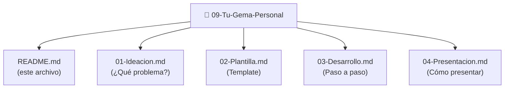

# Tu Gema Personal: Proyecto Integrador del Bloque 2
## Bienvenida al proyecto final
Has completado tres Gemas especializadas (Expedientes, Inventario, Procedimientos). Ahora toca crear **TU PROPIA GEMA** adaptada a tu puesto de trabajo.
Este es el proyecto integrador donde aplicas TODO lo aprendido:
- ✅ Diseño especializado
- ✅ Contexto relevante
- ✅ Prompts prácticos
- ✅ Testing riguroso
- ✅ Iteración continua
## ¿Qué es Tu Gema Personal?
Una Gema diseñada específicamente para **tu rol, tus problemas, tus tareas diarias**.
**Ejemplos:**
- **Si eres gestor de subvenciones:** Gema especializada en requisitos y plazos de cada convocatoria
- **Si trabajas en Policía Local:** Gema especializada en procedimientos sancionadores
- **Si eres interventor:** Gema para validación de informes presupuestarios
- **Si trabajas en Urbanismo:** Gema para procedimientos de licencias y permisos
- **Si eres trabajador social:** Gema para evaluación de situaciones de vulnerabilidad
- **Si eres responsable de compras:** Gema para clasificación de proveedores y mejores prácticas
## Por qué es importante
Después de crear Tu Gema Personal:
✅ **Automatizas tareas repetitivas**
✅ **Reduces errores procedimentales**
✅ **Aceleras decisiones complejas**
✅ **Documentas tu conocimiento experto**
✅ **Puedes transferir al equipo**
✅ **Ganas credibilidad como experto en IA**
## Estructura del proyecto

### Qué encontrarás en cada sección
**01-Ideacion.md:**
- Cómo identificar tu problema
- Ejercicios para definir qué resuelve tu Gema
- Ejemplos por puesto de trabajo
- Plantilla para documentar tu idea
**02-Plantilla.md:**
- Template listo para rellenar
- Secciones: Objetivo, Contexto, Funcionalidades, Restricciones, Prompts, Casos uso
- Solución guiada
**03-Desarrollo.md:**
- Paso a paso práctico
- Cómo escribir el prompt del sistema
- Cómo incorporar contexto
- Cómo testear y refinar
- Checklist de validación
**04-Presentacion.md:**
- Cómo explicar tu Gema a no-expertos
- Plantilla de presentación
- Cómo obtener feedback
- Cómo mejorar basado en feedback
## Cronograma sugerido

```mermaid
graph TD
    A["📅 CRONOGRAMA DEL PROYECTO"]
    B["📅 DÍA 1: 2 horas"]
    B --> B1["Lee 01-Ideacion.md"]
    B --> B2["Completa plantilla"]
    B --> B3["Valida con jefe"]
    C["📅 DÍA 2: 2 horas"]
    C --> C1["Lee 02-Plantilla.md"]
    C --> C2["Completa secciones"]
    C --> C3["Revisa con compañero"]
    D["📅 DÍA 3: 3 horas"]
    D --> D1["Lee 03-Desarrollo.md"]
    D --> D2["Construye tu Gema"]
    D --> D3["Testa 5+ casos"]
    D --> D4["Refina resultados"]
    E["📅 DÍA 4: 1-2 horas"]
    E --> E1["Lee 04-Presentacion.md"]
    E --> E2["Prepara demo"]
    E --> E3["Presenta al equipo"]
    E --> E4["Recoge feedback"]
    F["🔄 SEMANA 2+"]
    F --> F1["Implementa feedback"]
    F --> F2["Expande tu Gema"]
```

 Itera basado en feedback
 Documenta casos de éxito
 Expande funcionalidades
```
**Tiempo total estimado:** 10-14 horas (puedes hacer en 3-4 días con dedicación)
## Requisitos
Antes de empezar, asegúrate que:
✅ **Completaste el Bloque 2 anterior** (Tu Primera Gema)
✅ **Estudiaste una o más Gemas especializadas** (Expedientes, Inventario, Procedimientos)
✅ **Tienes acceso a herramienta IA** (ChatGPT, Claude, similar)
✅ **Identificas claramente tu problema** (no debe ser vago)
✅ **Tienes datos/ejemplos reales** para testear
## Criterios de éxito
Tu Gema Personal es "completa" cuando:
✅ **Objetivo claro:** Puedes explicarlo en 1 frase
✅ **Diseño sólido:** Tiene secciones: Objetivo, Contexto, Funcionalidades, Restricciones
✅ **Prompt funcional:** Testeado con 10+ casos, 80%+ aciertos
✅ **Documentado:** Otros pueden usarla sin ayuda
✅ **Presentable:** Tu equipo lo valida y lo usa
## Próximos pasos
### 👉 Comienza ahora:
1. **Abre 01-Ideacion.md**
2. **Responde: ¿Cuál es tu problema laboral?**
3. **Sigue los ejercicios propuestos**
4. **Avanza a 02-Plantilla.md cuando estés listo**
---
**¡Esto es tuyo. Hazlo personal. Hazlo útil. Hazlo profesional!**
Este es el momento donde teoría se convierte en herramienta que usas TODOS LOS DÍAS en tu trabajo.
Vamos 👇
---
## FAQ: Preguntas comunes
**P: ¿Qué pasa si mi problema es muy específico?**
R: Mejor aún. Las Gemas específicas son más útiles que genéricas.
**P: ¿Necesito ser experto en IA?**
R: No. Solo necesitas entender tu problema y cómo resolverlo.
**P: ¿Puedo cambiar de idea a mitad?**
R: Sí. Es iterativo. Mejor pivotar pronto que seguir en la dirección equivocada.
**P: ¿Y si mi Gema falla?**
R: Aprenderás más de un fracaso que de un éxito. Itera y refina.
**P: ¿Puedo compartir mi Gema?**
R: Totalmente. Motiva a otros a crear las suyas.
---
## Recursos adicionales
- **Ejemplo de Gema exitosa:** Espere en tu administración (si la hay)
- **Feedback de peers:** Pide a compañeros que la prueben
- **Mejora continua:** No es "terminada", es "en evolución"
¡Adelante con Tu Gema Personal!
