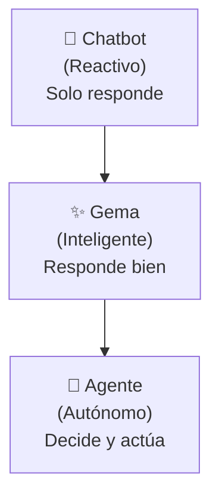

# Qué es un Agente de IA

## 🎯 Objetivo

Entender la definición de un agente de IA y reconocer por qué es diferente a un asistente de chat convencional.

## 📖 Qué vamos a aprender

Cuando hablamos de un **agente de IA**, nos referimos a un sistema que puede:
- **Decidir** qué hacer sin que le digas cada paso
- **Actuar** utilizando herramientas reales (bases de datos, emails, documentos)
- **Planificar** para alcanzar un objetivo
- **Aprender** de lo que ocurre y ajustarse
- **Persistir** - seguir trabajando aunque no le estés vigilando

Un agente no es solo un chatbot más inteligente. Es un asistente que entiende un objetivo final y puede decomponerlo en pasos, decidir qué hacer, y ejecutar esas acciones.

## 📚 Definición Simple

> **Un agente de IA es un sistema autónomo que observa su entorno, toma decisiones basadas en objetivos, y realiza acciones mediante herramientas para resolver problemas sin intervención continua.**

## 🔄 La Evolución: Chat → Gema → Agente

Hemos visto esta progresión en el taller:

- **Chatbot**: "¿Cuál es la capital de España?" → Responde "Madrid"
- **Gema (Claude, ChatGPT)**: "Crea un análisis del PIB español" → Genera un documento completo y bien estructurado
- **Agente**: "Procesa todas las solicitudes de subvención del mes" → Descarga datos, valida, calcula, genera reportes, envía emails

## 💡 Las 5 Características Clave

### 1. Autonomía
El agente **decide** qué hacer. No espera a que le des cada instrucción. Le das un objetivo y él gestiona los pasos.

*Ejemplo*: "Procesa las solicitudes de subvención" → El agente decide automáticamente: primero valida, luego calcula puntuación, luego comprueba conflictos de interés, luego genera el informe.

### 2. Planificación
El agente **desglosa** el objetivo en tareas. Entiende que para llegar a meta B, primero necesita completar A y C.

*Ejemplo*: Para "generar informe mensual", el agente sabe que debe: 1) Conectar a base de datos, 2) Extraer datos, 3) Calcular métricas, 4) Crear gráficos, 5) Formatear, 6) Enviar.

### 3. Herramientas
El agente **usa herramientas reales**: bases de datos, APIs, sistemas de email, documentos. No solo charla, hace.

*Ejemplo*: El agente puede acceder a tu base de datos de ciudadanos, leer un PDF de normativa, enviar un email, crear una hoja Excel.

### 4. Memoria
El agente **recuerda**. Aprende de interacciones anteriores, de errores, de lo que funciona. No olvida como un chatbot cuando terminas la sesión.

*Ejemplo*: "Siempre que esta persona pide subvención, falta su CIF. Recordaré validarlo en el futuro."

### 5. Supervisión
El agente es autónomo **pero siempre con un humano en control**. No toma decisiones críticas sin permiso. Es "autónomo dentro de límites".

*Ejemplo*: El agente puede procesar solicitudes automáticamente, pero si detecta una solicitud de más de 50.000€, pide autorización antes de aprobar.

## 🏛️ Ejemplos en Administración Pública

### Agente de Correo Administrativo
Procesa emails entrantes de ciudadanos, los clasifica, extrae información clave (nombre, DNI, asunto), y los dirige al departamento correcto.

### Agente de Tareas Administrativas
Revisa tu calendario, procesa solicitudes pendientes, genera reportes semanales, y te avisa de plazos próximos.

### Agente de Análisis de Normativa
Monitorea cambios en la normativa autonómica/estatal, resume cambios relevantes para tu municipio, y propone ajustes en procedimientos.

### Agente de Gestión Documental
Recibe documentos escaneados, lee OCR, extrae datos, valida con normativa, archiva automáticamente.

## 🎯 Ejercicio: Identifica Agentes en Tu Organización

Piensa en tu ayuntamiento, institución, o departamento. ¿Cuáles son procesos que se repiten constantemente y que alguien podría "automatizar"?

Escribe 3 tareas que hoy hace alguien manualmente y que un agente podría hacer 24/7 sin errores:

1. **Tarea 1**: 
   - ¿Qué se hace?: 
   - ¿Quién lo hace hoy?:
   - ¿Cuánto tiempo tarda?:

2. **Tarea 2**: 
   - ¿Qué se hace?: 
   - ¿Quién lo hace hoy?:
   - ¿Cuánto tiempo tarda?:

3. **Tarea 3**: 
   - ¿Qué se hace?: 
   - ¿Quién lo hace hoy?:
   - ¿Cuánto tiempo tarda?:

  
💡 Ejemplos de respuesta (haz clic para ver)

**Ejemplo 1 - Procesamiento de Solicitudes**
- ¿Qué se hace?: Recibir solicitudes de subvención, validar documentación, comprobar requisitos
- ¿Quién lo hace hoy?: Personal de ventanilla + administrativo
- ¿Cuánto tiempo tarda?: 30-45 minutos por solicitud × 100 solicitudes/mes = 50-75 horas/mes

**Ejemplo 2 - Respuesta a Ciudadanos**
- ¿Qué se hace?: Leer preguntas de ciudadanos, buscar respuesta en normativa, redactar respuesta
- ¿Quién lo hace hoy?: Personal de atención ciudadana
- ¿Cuánto tiempo tarda?: 15-20 minutos por pregunta × 200 preguntas/mes = 50-67 horas/mes

**Ejemplo 3 - Reportes Semanales**
- ¿Qué se hace?: Recopilar datos de 3 sistemas, crear gráficos, escribir resumen, enviar email
- ¿Quién lo hace hoy?: Jefe de departamento o administrativo
- ¿Cuánto tiempo tarda?: 3-4 horas cada semana (200+ horas/año)

## 🚀 Reto Avanzado

¿Cuáles serían los beneficios NO solo en tiempo, sino también en **calidad** si un agente hiciera esas tareas? Piensa en:

- **Consistencia**: El agente siempre hace lo mismo, nunca tiene un día malo
- **Trazabilidad**: Todo queda registrado, auditable
- **Precisión**: Sin errores por cansancio o falta de atención
- **24/7**: Funciona de noche, festivos, vacaciones
- **Escala**: Puede procesar 10 solicitudes o 1000 simultáneamente

¿Qué cambiaría en tu organización si todo eso fuera posible?

## ✅ Qué hemos aprendido

1. **Un agente es diferente a un chatbot**: No solo responde, actúa y decide
2. **5 características clave**: Autonomía, Planificación, Herramientas, Memoria, Supervisión
3. **Los agentes resuelven problemas de tiempo y errores**: 24/7, sin descanso, sin fallos humanos
4. **Todavía hay un humano en control**: Los agentes son autónomos dentro de límites definidos
5. **Tu administración tiene muchas oportunidades**: Ya hay procesos donde un agente cambiaría todo

---

**Próximo paso**: Vamos a ver exactamente qué diferencia un agente de un chatbot. Las similitudes son grandes, pero las diferencias son cruciales.
