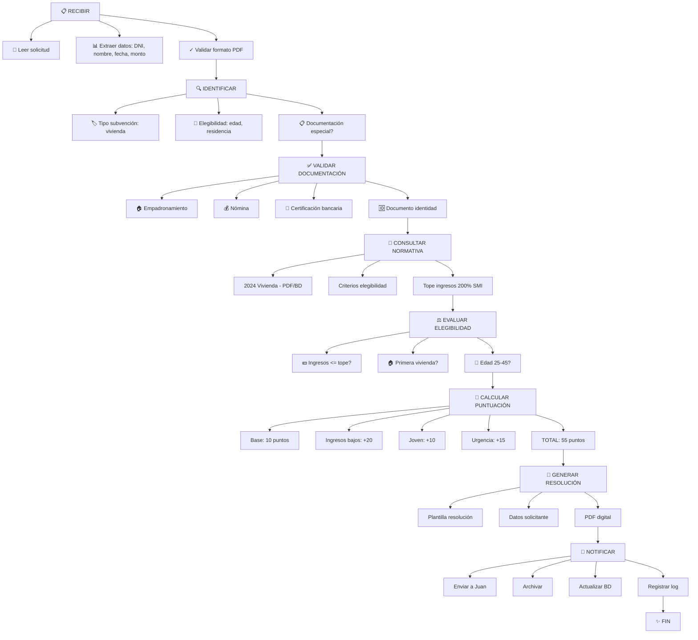

# Cómo un Agente Planifica Tareas

## 🎯 Objetivo

Entender cómo un agente desglosa un objetivo complejo en pasos ordenados y ejecutables.

## 📖 Qué vamos a aprender

La planificación es lo que diferencia un sistema competente de uno incompetente. Un buen plan = éxito. Mal plan = caos.

Cuando tú tienes un objetivo complejo ("preparar una presentación al concejal"), tu cerebro automáticamente lo desglosa:
```
1. Recopilar datos
2. Analizarlos
3. Encontrar insights clave
4. Diseñar slides
5. Practicar discurso
6. Revisar ortografía
7. Probar proyector
```

Un agente hace exactamente lo mismo, pero de forma **explícita y auditable**.

## 🔄 De Objetivo → Pasos → Ejecución

### Fase 1: Entender el Objetivo
```
Usuario (Tú): "Procesa todas las solicitudes de subvención 
               recibidas este mes, valida, calcula puntuación, 
               y genera reportes por departamento."

Agente piensa:
"Objetivo: Procesar solicitudes
Contexto: Este mes, validar, calcula, reportes
Restricciones: Solo subvenciones (no ayudas), solo recibidas (no borradores)"
```

### Fase 2: Desglosa Automáticamente
```
Agente planifica automáticamente:

PLAN GENERADO:
1. CONTEXTO
   - Obtener lista de solicitudes del mes
   - Confirmar que no hay solicitudes en proceso ya
   
2. VALIDACIÓN (para cada solicitud)
   - Verificar que existe solicitante en BD
   - Validar documentación requerida
   - Comprobar conflictos de interés
   
3. CÁLCULO (para cada solicitud)
   - Aplicar criterios de puntuación
   - Calcular puntos por cada criterio
   - Determinar si es elegible
   
4. CATEGORIZACIÓN
   - Agrupar por departamento
   - Ordenar por puntuación
   
5. REPORTES
   - Generar resumen por departamento
   - Crear gráficos
   - Formatear en PDF
   
6. NOTIFICACIÓN
   - Enviar reportes a jefes
   - Actualizar sistema
```

### Fase 3: Identifica Dependencias
```
El agente entiende que:
  - No puede calcular sin validar primero
  - No puede reportar sin calcular
  - Pueden validar en paralelo (solicitud 1 y 2 simultáneamente)
  - Reportes dependen de TODO

ORDEN LÓGICO:
Paso 1 → Paso 2 (para todos) → Paso 3 (para todos) 
  → Paso 4 (paralelo) → Paso 5 (paralelo) → Paso 6
```

## 📚 Ejemplo Guiado: Procesar Solicitud de Subvención

Veamos cómo un agente planifica procesar UNA solicitud:

### Objetivo Simple
"Procesa solicitud de Juan Pérez para subvención de vivienda"

### El Agente Planifica Automáticamente



### Lo Importante

El agente generó ese plan AUTOMÁTICAMENTE. No tuvo que decirle cada paso. Solo le dijiste "procesa" y él lo desglosó lógicamente.

## 💡 Variantes: Planes Flexibles

El mismo agente puede adaptarse:

### Plan A: Solicitud Estándar
```
Validar → Calcular → Aprobar → Notificar
(4 pasos, 5 minutos)
```

### Plan B: Solicitud con Dudas
```
Validar → Detectar problema → Pedir más info → Esperar respuesta 
→ Revalidar → Calcular → Proponer (requiere supervisor) → Notificar
(7 pasos, 1 día)
```

### Plan C: Solicitud con Error Normativa
```
Validar → Detectar conflicto legal → Alertar abogado 
→ Esperar consulta → Reinterpretar → Calcular con nuevo criterio 
→ Documentar excepción → Notificar (con explicación)
(8 pasos, 2 días, documentación legal)
```

El agente ELIGE el plan según contexto.

## 🎯 Ejercicio: Crea un Plan de 5 Pasos

Elige un proceso rutinario de tu trabajo. Desglosalo en máximo 5 pasos:

**Proceso**: _________________________

**Paso 1**: 
**Paso 2**: 
**Paso 3**: 
**Paso 4**: 
**Paso 5**: 

Ahora, pregúntate:
- ¿Hay dependencias? (Paso 2 requiere que Paso 1 esté hecho?)
- ¿Algún paso puede paralelizarse? (¿Pasos 3 y 4 simultáneamente?)
- ¿Hay decisiones? (Si X, entonces → Paso A; si no X, entonces → Paso B)

<details>
  <summary>💡 Ejemplo completo (haz clic para ver)</summary>

**Proceso**: "Responder consulta de ciudadano sobre estado de licencia"

**Paso 1**: Recibir consulta (email, teléfono, chat)
**Paso 2**: Identificar ciudadano en BD (DNI, expediente)
**Paso 3**: Obtener estado actual (BD licencias)
**Paso 4**: Generar respuesta clara (estado + próximos pasos)
**Paso 5**: Enviar respuesta (mail/SMS/llamada)

**Dependencias**: Paso 2 → Paso 3 (necesito expediente para consultar estado)
**Paralelos**: Paso 1 y 2 pueden solaparse (mientras leo, puedo empezar búsqueda)
**Decisiones**: 
  - Si estado = APROBADO → incluir resolución
  - Si estado = PENDIENTE → estimar cuándo
  - Si expediente no existe → redirigir o avisar error

</details>

## 🚀 Reto Avanzado

Aquí viene lo interesante: **replanificación**.

¿Qué pasa si durante la ejecución del plan algo sale mal?

Ejemplo:
```
Plan original:
  1. Validar documentación ✓
  2. Consultar normativa ✓
  3. Calcular puntuación → ✗ ERROR: BD normativa no responde
  4. Generar resolución (NO se ejecuta, esperando Paso 3)
  5. Notificar
```

Un agente inteligente no se queda congelado. **Replanifica**:

```
REPLANIFICACIÓN AUTOMÁTICA:
- Detectar que BD no responde
- Esperar 30 segundos (quizá es temporal)
- Reintentar conexión
- Si sigue fallando: Usar normativa en CACHÉ (datos locales)
- Si no hay caché: ESCALAR a humano ("No puedo consultar BD")

Nuevamente: Usuario (tú) autoriza usar normativa de hace 1 semana (confiable)
Agente: Continúa con ese plan alternativo
Resultado: Se procesa igual, pero documentamos "usó normativa 2024-06-20"
```

**Pregunta para ti**: ¿Qué planes tiene tu trabajo donde algo "podría salir mal"? ¿Cuál sería el plan B?

## ✅ Qué hemos aprendido

1. **La planificación es explícita**: El agente desglosa el objetivo en pasos
2. **El agente entiende dependencias**: Sabe qué debe hacer antes que qué
3. **Hay márgenes para flexibilidad**: Distintos planes según contexto
4. **El replanificación es crítica**: Cuando algo falla, el agente improvisa y avanza

---

**Próximo paso**: Una vez planificado, ¿qué herramientas usa el agente para ejecutar ese plan?
