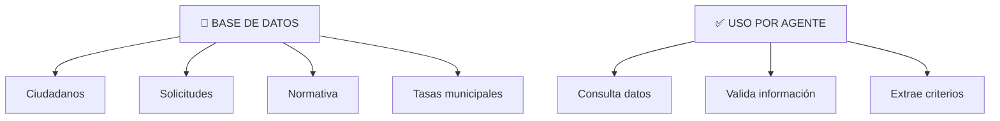

# Las Herramientas del Agente

## 🎯 Objetivo

Entender qué son las herramientas y cómo el agente las usa para actuar en tus sistemas reales.

## 📖 Qué vamos a aprender

Un agente sin herramientas es un teórico. Con herramientas, es un ejecutor.

Las herramientas son las conexiones del agente a sistemas reales:
- Bases de datos
- APIs (conexiones externas)
- Servicios de email
- Procesamiento de documentos
- Sistemas de gestión

## 🔧 Qué es una Herramienta

Una **herramienta** es una capacidad que el agente puede usar. Es como darle a alguien "acceso al servidor" o "poder enviar un email en nombre de la organización".

```
SIN HERRAMIENTAS:
Agente: "Creo que deberíamos enviar un email a Juan"
Tú: "Sí, ve y envía"
Agente: "Pero... no sé cómo"

CON HERRAMIENTAS:
Agente: "Necesito enviar email a Juan"
Agente: [Usa herramienta: Envío de Email]
Resultado: Email realmente enviado
```

## 📚 Ejemplos de Herramientas Comunes

### Herramienta 1: Base de Datos



### Herramienta 2: Email
```
Qué hace: Enviar emails automáticamente
Ejemplos:
  - Notificar ciudadano de resolución
  - Avisar administrativo de solicitud pendiente
  - Confirmación automática de recepción

Cómo la usa el agente:
Agente: "Necesito enviar resolución a ciudadano"
[Usa herramienta: Envío de Email]
Parámetros:
  - Para: juan@mail.com
  - Asunto: "Resolución de tu solicitud de subvención"
  - Cuerpo: [Mensaje personalizado]
  - Adjuntos: [PDF de resolución]
Resultado: Email enviado ✓
```

### Herramienta 3: Procesamiento de Documentos (OCR)
```
Qué hace: Leer documentos en PDF, imágenes, etc.
Ejemplos:
  - Leer PDF de normativa
  - Extraer datos de formularios escaneados
  - Reconocer texto en imágenes

Cómo la usa el agente:
Agente: "Necesito extraer nombre y DNI del formulario"
[Usa herramienta: OCR]
Archivos: [Imagen del formulario]
Resultado: 
  - Nombre: "Ana García López"
  - DNI: "98765432-L"
```

### Herramienta 4: API Externa
```
Qué hace: Conectar con servicios externos
Ejemplos:
  - Validar DNI (API AEAT)
  - Consultar catastro
  - Verificar datos en ASNEF
  - Comprobar soluciones bancarias

Cómo la usa el agente:
Agente: "Necesito validar que 12345678-X es un DNI válido"
[Usa herramienta: Validación DNI via API]
Resultado: "DNI válido, pertenece a ciudadano español"
```

### Herramienta 5: Generación de Documentos
```
Qué hace: Crear resoluciones, certificados, reportes
Ejemplos:
  - Generar PDF de resolución
  - Crear Excel de reportes
  - Generar certificados

Cómo la usa el agente:
Agente: "Necesito generar resolución de APROBACIÓN"
[Usa herramienta: Generador de PDF]
Parámetros:
  - Plantilla: "Resolución subvención"
  - Datos: [datos ciudadano + decisión]
Resultado: 
  - Archivo PDF generado y guardado
```

## 🎯 Cómo Define el Agente Qué Herramienta Usar

El agente tiene un "razonamiento" sobre qué herramienta elegir:

```
Objetivo: "Procesar solicitud de Juan"

Agente piensa automáticamente:
"Para procesar, necesito:
1. Datos de Juan → Herramienta: BD de ciudadanos
2. Validar su DNI → Herramienta: Validación externa
3. Leer documentos que adjuntó → Herramienta: OCR
4. Consultar normativa aplicable → Herramienta: BD de normativa
5. Generar resolución → Herramienta: Generador de PDF
6. Avisar a Juan → Herramienta: Envío de Email"

Agente ejecuta en orden, usando la herramienta correcta para cada paso.
```

## 🚧 Restricciones: Lo Que el Agente NO Puede Hacer

Las herramientas definen límites. Es seguridad:

```
HERRAMIENTAS PERMITIDAS:
✓ Leer base de datos de solicitudes
✓ Enviar email a ciudadanos
✓ Generar PDFs de resoluciones
✗ Acceder a datos de salud (privado)
✗ Modificar nóminas de empleados
✗ Cambiar normativa sin aprobación
✗ Hacer transferencias bancarias
✗ Eliminar datos (solo archivar)
```

El agente solo hace lo que explícitamente autorizas.

## 📚 Ejemplo Completo: Agente en Contratación

Imagina un agente que gestiona procesos de contratación pública.

### Herramientas Disponibles

1. **Lectura BD**: Acceso a base de datos de proveedores
2. **Validación**: API para validar CIF de empresa
3. **OCR**: Leer y extraer datos de ofertas
4. **Cálculo**: Evaluación de ofertas (precio, plazo, etc.)
5. **Generación**: Crear acta de evaluación
6. **Email**: Notificar resultados

### Flujo Real

```
PROCESO: Evaluación automática de ofertas de contratación

Recibe: 5 ofertas de proveedores para suministro de papel

PASO 1 - Validación básica [Herramienta: BD + API]
├─ Verificar que proveedor existe en BD
├─ Validar CIF mediante API
└─ Resultado: Todas válidas ✓

PASO 2 - Extracción de datos [Herramienta: OCR]
├─ Leer oferta 1: Precio €500, plazo 5 días
├─ Leer oferta 2: Precio €450, plazo 7 días
├─ Leer oferta 3: Precio €525, plazo 5 días
├─ Leer oferta 4: Precio €400, plazo 10 días
├─ Leer oferta 5: Precio €480, plazo 6 días
└─ Datos extraídos correctamente ✓

PASO 3 - Evaluación [Herramienta: Cálculo]
Criterios: 70% precio + 30% plazo
├─ Oferta 1: 70% + 30% = 100%... (cálculo detallado)
├─ Oferta 2: ...
├─ Oferta 3: ...
├─ Oferta 4: ... (GANADOR: Mejor relación)
├─ Oferta 5: ...
└─ Ranking generado

PASO 4 - Generación acta [Herramienta: Generador PDF]
├─ Crear acta de evaluación
├─ Incluir datos de ofertas
├─ Incluir puntuaciones
├─ Incluir justificación (qué proveedor gana y por qué)
└─ Acta generada ✓

PASO 5 - Notificaciones [Herramienta: Email]
├─ Email a proveedor ganador: "¡Felicidades! Tu oferta fue seleccionada"
├─ Email a otros: "Tu oferta ha sido evaluada"
├─ Email a director: "Evaluación completada. Acta adjunta"
└─ Notificaciones enviadas ✓

RESULTADO:
- Proceso que tardaba 3 horas = Completado en 5 minutos
- Sin errores de cálculo
- Completamente trazable y auditable
```

## 🎯 Ejercicio: Lista Herramientas para Tu Agente

Elige un proceso de tu trabajo. Piensa: ¿qué herramientas necesitaría un agente para automatizarlo?

**Proceso**: _________________________

**Herramientas necesarias:**
1. ___________________________
2. ___________________________
3. ___________________________
4. ___________________________
5. ___________________________

**Herramientas prohibidas** (por seguridad/privacidad):
1. ___________________________
2. ___________________________

<details>
  <summary>💡 Ejemplo (haz clic para ver)</summary>

**Proceso**: "Procesar solicitud de ayuda social"

**Herramientas necesarias:**
1. BD de ciudadanos (leer nombre, situación)
2. BD de criterios de elegibilidad
3. API AEAT (validar ingresos)
4. Generador de resolución
5. Sistema de pagos (registrar si se aprueba)

**Herramientas prohibidas:**
1. Acceso a datos de salud (confidencial)
2. Modificación de resoluciones sin auditoría
3. Acceso a datos de familia (solo lo necesario)

</details>

## 🚀 Reto Avanzado

Las herramientas son el límite del agente. Pregúntate:

**Pregunta 1**: Si tu agente tiene acceso a una herramienta, ¿cambia tu responsabilidad como supervisor?

*Ejemplo*: Si el agente puede aprobar subvenciones automáticamente, ¿quién es responsable si comete un error? ¿El agente? ¿Tú? ¿Los dos?

**Pregunta 2**: Algunas herramientas son "peligrosas". ¿Cuáles nunca darías a un agente? ¿Y por qué?

## ✅ Qué hemos aprendido

1. **Herramientas son el puente entre agente y acción**: Sin ellas, solo teoría
2. **El agente elige la herramienta correcta**: Razona sobre qué usar cuándo
3. **Las herramientas definen límites**: Seguridad + Control
4. **La configuración de herramientas es crítica**: Define qué puede y qué no puede hacer

---

**Próximo paso**: Con herramientas planificadas, ¿cómo el agente recuerda lo que aprende? Memoria.
