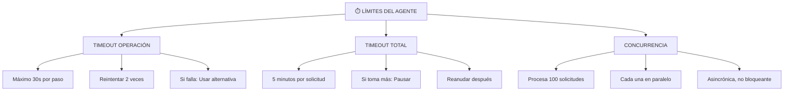

# Cómo Ejecuta un Agente Sus Tareas
## 🎯 Objetivo
Entender el loop de ejecución paso a paso: observar → decidir → actuar.
## 📖 Qué vamos a aprender
Un agente no funciona de forma mágica. Tiene un proceso. Un loop.
En cada iteración:
1. **Observa**: ¿Qué necesito hacer? ¿Cuál es mi estado actual?
2. **Decide**: ¿Cuál es el próximo paso? ¿Tengo todo lo necesario?
3. **Actúa**: Ejecuto la acción usando las herramientas
4. **Verifica**: ¿Funcionó? ¿Hay errores?
5. **Repite**: Siguiente paso
## 🔄 El Loop: Observar → Decidir → Actuar
### Iteración 1: Observación
```
AGENTE DESPIERTA CON OBJETIVO:
"Procesa la solicitud de Ana de subvención rural"
OBSERVA:
- ¿Tengo la solicitud? SÍ (está en sistema)
- ¿La solicitud es válida? [Revisar]
- ¿Puedo acceder a datos de Ana? SÍ
- ¿Tengo acceso a normativa? SÍ
- ¿Tengo permisos para procesar? SÍ
DECISIÓN: "Todos los requisitos se cumplen, puedo proceder"
```
### Iteración 2: Primer Paso
```
OBJETIVO: Validar solicitud
DECIDE: "Paso 1: Validar que Ana existe en BD"
ACTÚA: 
  [Usa herramienta: BD]
  → Busca DNI de Ana
  → Encuentra: Ana García, DNI 12345678-X, vive en rural
VERIFICA: "¿Existe? SÍ"
SIGUIENTE: "Paso 1 completado ✓"
```
### Iteración 3: Segundo Paso
```
OBJETIVO: Validar documentación
DECIDE: "Paso 2: Verificar documentos adjuntos"
ACTÚA:
  [Usa herramienta: OCR]
  → Lee PDF de formulario: ✓ Presente
  → Lee PDF de nómina: ✓ Presente
  → Lee PDF de certificado: ✓ Presente
  → Lee certificado de empadronamiento: ✗ FALTA
VERIFICA: "¿Tiene todo? NO - falta empadronamiento"
DECISIÓN:
  Opción A: Rechazar solicitud (incompleta)
  Opción B: Solicitar documento faltante (dar oportunidad)
  Normativa dice: "Dar 10 días para completar"
ACCIÓN:
  [Usa herramienta: Generador PDF + Email]
  → Genera requerimiento
  → Envía email: "Ana, falta empadronamiento. Adjunta antes del 15 de julio"
  → Estado solicitud: PENDIENTE_DOCUMENTACIÓN
SIGUIENTE: Esperar respuesta (o timeout en 10 días)
```
### Manejo de Errores: Cuando Algo Falla
```
ITERACIÓN 4: Consultar Normativa
DECIDE: "Paso 3: Aplicar criterios de subvención rural"
ACTÚA:
  [Usa herramienta: BD Normativa]
  → Intenta conectar
  → ERROR: Base de datos no responde
MANEJO DE ERROR:
  Opción 1: Reintentar (quizá fue temporal)
  → Espera 5 segundos
  → Reintenta
  → Falla nuevamente
  Opción 2: Usar datos en caché (datos locales guardados)
  → Tiene normativa guardada desde ayer
  → Usa esa (documenta fecha: "Normativa 2024-06-30")
  → Continúa
  Opción 3: Escalar (si es crítico)
  → Si hubiera sido crítico: pedir permiso a humano
  → Esperar decisión manual
```
## ⏱️ Tiempos y Límites
Un agente debe tener límites para no quedarse congelado:

## 📚 Ejemplo Paso a Paso: Procesando una Solicitud Completa
```
ENTRADA: Solicitud de Juan para licencia de obra
CICLO 1: OBSERVACIÓN
 ¿Tengo solicitud? SÍ
 ¿Es mi competencia? SÍ (licencia)
 Listo para procesar
CICLO 2: IDENTIFICAR TIPO
 Leo solicitud
 Identifica: "Licencia de obra nueva, <100m²"
 Aplica procedimiento: "Simplificado"
 Plan de pasos: 4 (vs 8 normal)
CICLO 3: VALIDAR SOLICITANTE
 Usa herramienta: BD de ciudadanos
 Busca Juan
 Resultado: "Existe, mayor edad, no antecedentes administrativos"
 Decisión: VÁLIDO ✓
 Siguiente
CICLO 4: VALIDAR DOCUMENTACIÓN
 Usa herramienta: OCR
 Encuentra: proyecto arquitectónico ✓, planos ✓
 Falta: certificado de propiedad ✗
 Decisión: SOLICITAR falta
 Acción: Email a Juan "Falta certificado"
 Estado: PENDIENTE
 [Aquí el proceso se pausa, espera respuesta]
[3 DÍAS DESPUÉS]
CICLO 5: REANUDAR (Juan envió certificado)
 Vuelve a validar
 Certificado recibido ✓
 Decisión: Documentación COMPLETA ✓
 Siguiente
CICLO 6: CONSULTAR NORMATIVA
 Usa herramienta: BD Normativa + PGOU
 Consulta: "Licencia obra < 100m² rural"
 Resultado: "Permitido, requiere distancia mínima a viviendas"
 Decisión: Verificar distancia
 Siguiente
CICLO 7: VERIFICAR DISTANCIA
 Usa herramienta: API Catastro
 Localiza obra: Coordenadas X,Y
 Distancia a vivienda más cercana: 150m
 Normativa requiere: 100m mínimo
 Decisión: CUMPLE ✓
 Siguiente
CICLO 8: CALCULAR TASA
 Usa herramienta: Tabla de tasas
 Superficie: 75 m²
 Tarifa: €15/m²
 Total: 75 × 15 = €1.125
 Decisión: Tasa €1.125 ✓
 Siguiente
CICLO 9: GENERAR RESOLUCIÓN
 Usa herramienta: Generador de PDF
 Plantilla: "Licencia Aprobada"
 Datos: Juan, obra, tasa, condiciones
 Resultado: PDF generado
 Decisión: Resolución lista ✓
 Siguiente
CICLO 10: NOTIFICAR
 Usa herramienta: Email + Sistema
 Email a Juan: "Tu licencia APROBADA. Tasa: €1.125"
 Adjunta: PDF de resolución
 Actualiza BD: Licencia = APROBADA
 Notifica a urbanismo: "Nueva licencia procesada"
 Decisión: Notificación enviada ✓
 FIN
RESULTADO FINAL:
✓ Solicitud procesada completamente
✓ Resolución generada
✓ Ciudadano notificado
✓ Sistema actualizado
✓ Auditoría completa disponible
TIEMPO TOTAL: ~10 minutos (si no hay esperas)
                1-3 días (si ciudadano tarda en responder)
```
## 🎯 Ejercicio: Define el Loop para Tu Caso
**Proceso**: ___________________________
Escribe los ciclos paso a paso:
**Ciclo 1**: 
**Ciclo 2**: 
**Ciclo 3**: 
**Ciclo 4**: 
Para cada ciclo, piensa:
- ¿Qué observa el agente?
- ¿Qué decide?
- ¿Qué acción toma?
- ¿Qué puede fallar?
<details>
  <summary>💡 Ejemplo: Procesamiento de Denuncia Ciudadana (haz clic para ver)</summary>
**Ciclo 1: RECIBIR**
- Observa: Email de ciudadano con denuncia
- Decide: ¿Es válida? ¿Mi competencia?
- Acción: Si válida, registra en BD
**Ciclo 2: CLASIFICAR**
- Observa: Contenido de denuncia
- Decide: ¿Qué tipo? (urbanismo, ruidos, limpieza, etc.)
- Acción: Asigna categoría
**Ciclo 3: INVESTIGAR**
- Observa: ¿Hay denuncias previas del mismo lugar?
- Decide: ¿Necesito inspección o es patrón conocido?
- Acción: Consulta BD de antecedentes
**Ciclo 4: RESPONDER**
- Observa: Resultado de investigación
- Decide: ¿Se confirma infracción?
- Acción: Genera acta o archivo. Notifica.
</details>
## 🚀 Reto Avanzado
**Recuperación ante Fallos**
¿Qué pasa si en Ciclo 7 la API de catastro falla? El agente necesita "Plan B":
```
ESTRATEGIA 1: Reintentar
 Si falla de forma temporal, reintentar
ESTRATEGIA 2: Usar datos locales (Caché)
 Si tenemos datos de antes, usar esos
ESTRATEGIA 3: Aproximación alternativa
 Si API no funciona, consultar mapa local guardado
ESTRATEGIA 4: Escalar
 Si nada funciona: "Humano, necesito que revises distancias"
 El supervisor revisa manualmente
ESTRATEGIA 5: Pausa indefinida (último recurso)
 "No puedo continuar. Espero a que se repare el sistema"
 Licencia queda "PAUSADA"
```
¿Cuál estrategia usarías en tu caso? ¿Y en qué orden?
## ✅ Qué hemos aprendido
1. **El loop es: Observar → Decidir → Actuar → Verificar → Repetir**
2. **Cada ciclo es una decisión independiente**
3. **Los errores se manejan, no rompen el proceso**
4. **Hay límites de tiempo para evitar bloqueos**
5. **La recuperación ante fallos es crítica**
---
**Próximo paso**: Con ejecución clara, ¿cómo supervisamos que el agente no se descontrole?
