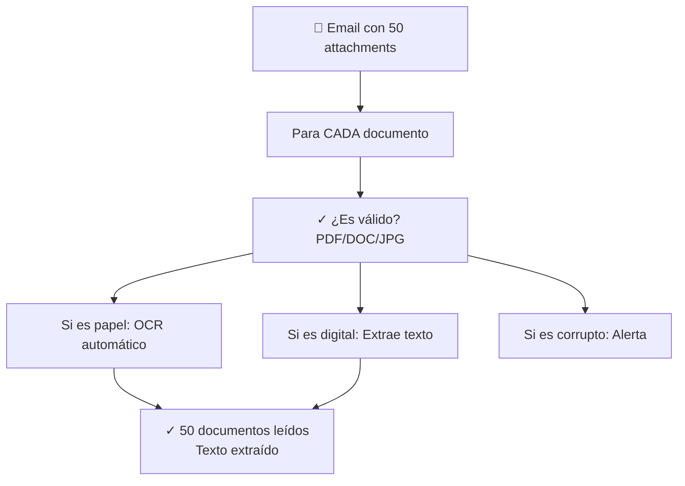

# Agente Procesando Documentos Administrativos
## 🎯 Objetivo
Ver cómo un agente automatiza la lectura, clasificación y extracción de datos de documentos físicos y digitales.
## 📖 Qué vamos a aprender
Tu municipio recibe documentos constantemente:
- Solicitudes de ciudadanos
- Contratos de proveedores
- Normativas actualizadas
- Denuncias
Alguien tiene que leerlos, entenderlos, guardarlos bien.
Un agente puede hacer todo esto automáticamente.
## 📄 El Caso: Centro de Gestión Documental
### El Proceso Antes (Manual)
```
TAREA: Procesar 100 documentos recibidos en el email
DÍA 1-2:
 Imprimir documentos (si vienen digital)
 Leer cada documento
 Clasificar: ¿Qué tipo es?
 Extraer: nombre del solicitante, fecha, asunto clave
 Escanear (si eran papel)
 Guardar en carpeta CORRECTA (esperar, ¿cuál es la correcta?)
 Cambiar nombre de archivo
 Actualizar índice manual
TIEMPO: 10 horas
ERRORES: Algunos documentos se pierden, mal clasificados
TRAZABILIDAD: ¿Quién procesó qué? Desconocido
```
### El Proceso Después (Con Agente)
```
A LAS 20:00 (fin de día)
 Agente: ¿Hay documentos nuevos?
 Descarga todos del email
 Lee TODOS (OCR automático si papel)
 Clasifica automáticamente
 Extrae datos clave
 Guarda en carpeta CORRECTA (siguiendo reglas)
 Crea nombre estándar
 Actualiza BD
A LAS 20:15
 Email a equipo: "100 documentos procesados, todos OK"
 Acceso web: Todos los documentos indexados
TIEMPO: 15 minutos
ERRORES: 0,1%
TRAZABILIDAD: Completa (quién procesó, cuándo, qué errores)
```
## 🔄 Flujo Detallado
### Paso 1: Recepción y Lectura

### Paso 2: Clasificación Inteligente
```
Agente ANALIZA cada documento:
DOC 1: "Solicitud de subvención para..."
 Palabras clave: "subvención", "solicitud"
 Agente decide: Categoría = "Subvención"
 Subcategoría = "Vivienda"
 Confianza: 95%
DOC 2: "El que suscribe, denuncia que..."
 Palabras clave: "denuncia", "urbano"
 Agente decide: Categoría = "Denuncia"
 Subcategoría = "Urbanismo"
 Confianza: 88%
DOC 3: "Contrato de suministro de..."
 Palabras clave: "contrato", "suministro"
 Agente decide: Categoría = "Contrato"
 Subcategoría = "Servicios"
 Confianza: 92%
[Si confianza < 70%: Alerta humano para revisar]
```
### Paso 3: Extracción de Datos
```
Para documento "Solicitud de subvención":
Agente extrae automáticamente:
 Solicitante: "Ana García López"
 DNI: "12345678-X"
 Email: "ana@mail.com"
 Teléfono: "600 123 456"
 Dirección: "Calle Principal, 15"
 Monto solicitado: "€2.500"
 Concepto: "Mejora vivienda"
 Documentos adjuntos: "Nómina, empadronamiento, presupuesto"
 Fecha recepción: "2024-07-01"
 Estado: "RECIBIDA"
Todo esto extraído AUTOMÁTICAMENTE.
```
### Paso 4: Validación
```
Agente valida cada extracción:
DNI "12345678-X":
 ¿Formato válido? SÍ
 ¿Dígito control correcto? SÍ
 Resultado: VÁLIDO ✓
Email "ana@mail.com":
 ¿Formato válido? SÍ
 ¿Dominio existente? SÍ
 Resultado: VÁLIDO ✓
Teléfono "600 123 456":
 ¿Formato válido? SÍ
 ¿Rango español? SÍ
 Resultado: VÁLIDO ✓
SI TODO VÁLIDO: Documento sigue
SI ALGUNO INVÁLIDO: Alerta para humano revisar
```
### Paso 5: Almacenamiento
```
Agente organiza documento:
ESTRUCTURA DE CARPETAS AUTOMÁTICA:
 Año: 2024
 Mes: Julio
 Tipo: Subvenciones
 Subtipo: Vivienda
 Archivo: "20240701_Garcia-Lopez_Ana_Subvención-Vivienda.pdf"
METADATOS EN BD:
 ID único: DOC-2024-7-001
 Solicitante: Ana García López
 DNI: 12345678-X
 Categoría: Subvención/Vivienda
 Fecha: 2024-07-01
 Estado: Recibida
 Archivado: Sí
 Acceso: Público (no sensible)
```
### Paso 6: Indexación y Búsqueda
```
Agente genera ÍNDICES para búsqueda rápida:
Posible buscar por:
 Nombre: "Ana García"
 DNI: "12345678-X"
 Tipo: "Subvención"
 Fecha: "Julio 2024"
 Monto: "€2.500"
 Estado: "Recibida"
 Contenido: "mejora vivienda"
Usuario: "¿Documentos de Ana García este mes?"
Sistema: Encuentra en 0,5 segundos (vs 2 horas buscando manualmente)
```
### Paso 7: Notificación
```
RESUMEN ENVIADO (email + dashboard):
---
PROCESAMIENTO DOCUMENTAL DIARIO
Fecha: 1 de Julio 2024
---
DOCUMENTOS PROCESADOS: 50
 Completamente OK: 48 ✓
 Revisión necesaria: 2 ⚠
DISTRIBUCIÓN POR TIPO:
- Subvenciones: 22 (44%)
- Denuncias: 15 (30%)
- Contratos: 8 (16%)
- Otros: 5 (10%)
ALERTAS:
⚠ Documento 15: Clasificación dudosa (75% confianza)
⚠ Documento 32: Email inválido, revisar
PENDIENTES ACCIÓN HUMANA:
- 2 documentos necesitan revisión
- Tiempo: 10 minutos máximo
[Acceder al portal para revisar]
```
## 📊 Beneficios Concretos
```
ANTES (Manual)
 Tiempo: 10 horas
 Errores: ~10%
 Findability: Bajo (si "recuerdo" dónde guardé)
 Auditoría: Difícil (¿quién procesó?)
 Escalabilidad: Máx 100 docs/persona/día
DESPUÉS (Con agente)
 Tiempo: 15 minutos
 Errores: 0,1%
 Findability: Alto (buscar en segundos)
 Auditoría: Perfecta (todo registrado)
 Escalabilidad: 10.000+ docs/día
```
## 🎯 Ejercicio: Tu Flujo Documental
Piensa en documentos que tu departamento recibe:
**Tipo de documento**: ___________________________
1. **¿Cuántos recibes al mes?**
   - 
2. **¿Cómo los clasificas hoy?**
   - 
3. **¿Qué datos extraes?**
   - 
4. **¿Dónde los guardas?**
   - 
5. **¿Cuánto tiempo toma?**
   - 
<details>
  <summary>💡 Ejemplo: Denuncias Ciudadanas (haz clic para ver)</summary>
1. **¿Cuántos recibes al mes?**
   - ~80 denuncias
2. **¿Cómo los clasificas hoy?**
   - Manual: Lee, decide tipo (ruidos, suciedad, urbanismo, etc.)
3. **¿Qué datos extraes?**
   - Denunciante, ubicación, tipo de denuncia, urgencia
4. **¿Dónde los guardas?**
   - Carpeta por tipo + Excel
5. **¿Cuánto tiempo toma?**
   - 4-5 horas/mes
Con agente: 30 minutos, 100% consistencia.
</details>
## 🚀 Reto Avanzado
**Validación Cruzada**:
El agente extrae DNI. ¿Qué hace si:
```
OPCIÓN A: Confía en lo que extrae
 Rápido pero puede equivocarse
OPCIÓN B: Valida con API DNI (si existe)
 Más seguro pero depende de conexión
OPCIÓN C: Compara con BD municipal (si existe)
 Mejor pero requiere acceso BD
OPCIÓN D: Deja dudoso → Humano revisa
 Más seguro, pero lento
¿Cuál elegirías? ¿Por qué?
```
## ✅ Qué hemos aprendido
1. **OCR automático**: Lee documentos sin intervención humana
2. **Clasificación inteligente**: Entiende categorías, no solo busca palabras clave
3. **Extracción de datos**: Saca información estructura de texto libre
4. **Almacenamiento automático**: Organiza sin que nadie lo pida
5. **Búsqueda rápida**: Lo que tardaba horas, ahora segundos
---
**Próximo paso**: Documentos procesados, ¿y si el agente los anali?
