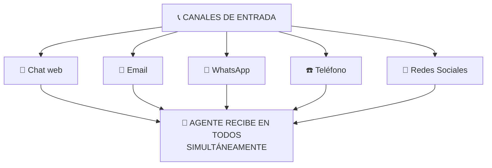
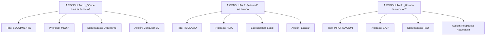

# Agente Atendiendo Consultas de Ciudadanos

## 🎯 Objetivo

Ver cómo un agente puede manejar el primer nivel de atención a ciudadanos, clasificando, resolviendo o escalando según sea necesario.

## 📖 Qué vamos a aprender

Centro de atención: 100 consultas diarias de ciudadanos.
Problema: Solo 5 personas, solo horario de oficina (8-14h).
Resultado: Colas, frustración, gente sin respuesta.

Un agente puede cambiar esto.

## 📞 El Caso: Centro de Atención al Ciudadano

### El Problema Actual

```
MAÑANA (9:00-14:00)
├─ Llegan 100 ciudadanos (en persona, email, teléfono, chat)
├─ Personal disponible: 5 personas (1 cada 20 consultas)
├─ Tiempo por consulta: 10-15 minutos
├─ Capacidad real: ~150-180 consultas/día (si TODO fuera ágil)
├─ Resultado REAL: Colas, esperas, frustración

TIPOS DE CONSULTA:
├─ 40% son preguntas simples (FAQ)
│   "¿Cuál es horario?", "¿Qué documentos necesito?"
├─ 30% son seguimiento de expedientes
│   "¿Dónde está mi licencia?"
├─ 20% son problemas reales
│   "Se me perdió la solicitud"
├─ 10% son escaladas complejas
│   Necesitan especialista
```

### La Solución: Agente en Primer Nivel

```
CHATBOT DISPONIBLE 24/7 (WhatsApp, web, email)

CIUDADANO LLEGA:
├─ Chat: "¿Dónde está mi solicitud?"
├─ Agente: 3 segundos de espera máximo
├─ Agente responde: [Consulta BD] "Está en revisión desde hace 5 días"
├─ Ciudadano: Problema resuelto, seguimiento claro

VERSUS

PERSONA (Hoy):
├─ Ciudadano: Espera 45 minutos en cola
├─ Llama a mostrador
├─ Administrativo: "Un momento, dejame buscar"
├─ Tarda: 5 minutos en buscar
├─ Respuesta: "Está ahí, 5 días"
├─ Ciudadano: Frustrado, misma información, pero después de 50 min
```

## 🔄 Flujo: Recepción → Clasificación → Decisión

### Paso 1: Recepción



### Paso 2: Clasificación Automática


```

### Paso 3: Decisión Automática vs Escalada

```
MATRIZ DECISIÓN:

┌────────────────────────────────────────────┐
│ ¿PUEDE EL AGENTE RESPONDER?               │
├────────────────────────────────────────────┤
│                                            │
│ FAQ (40% de consultas):                    │
│ SÍ → Responde automáticamente              │
│ Ejemplo: "¿Horario?" → "8:00-14:00"       │
│                                            │
│ Seguimiento expediente (30%):              │
│ SÍ → Consulta BD, responde                 │
│ Ejemplo: "¿Licencia?" → "En revisión"     │
│                                            │
│ Trámite simple (15%):                      │
│ SÍ → Guía, cita cita si necesario          │
│ Ejemplo: "¿Cita?" → "Para mañana a las 10"│
│                                            │
│ Problema complejo (10%):                   │
│ NO → Escalada a persona                    │
│ Ejemplo: "Reclamo grande" → "Te paso..."  │
│                                            │
│ Escalada: PERSONA en 2-5 minutos           │
│ (vs 45 minutos de espera)                  │
│                                            │
└────────────────────────────────────────────┘
```

### Paso 4: Respuestas Automáticas (Ejemplos)

```
PREGUNTA: "¿Cuáles son los requisitos para licencia de obra?"
AGENTE RESPONDE:
"Para licencia de obra necesitas:
✓ Formulario de solicitud
✓ Planos del proyecto
✓ Certificado de propiedad
✓ Presupuesto de obras
✓ Documentación técnica

¿Necesitas más detalles de alguno?"
[Botones: Sí, No]

---

PREGUNTA: "¿Dónde está mi solicitud de subvención?"
[Agente extrae DNI/nombre de contexto o lo pide]
[Consulta BD]
AGENTE RESPONDE:
"Tu solicitud de subvención:
📅 Fecha recepción: 15 de junio
📊 Estado: EN EVALUACIÓN
📍 Ubicación: Departamento urbanismo
⏰ Tiempo estimado: 5 días más (aprox. 20 de junio)

Seguimiento: Te enviaremos email cuando se resuelva"

---

PREGUNTA: "Tengo una emergencia, perdí la licencia de obra que me dieron el año pasado"
[Agente identifica problema complejo]
AGENTE RESPONDE:
"Entiendo, necesitas duplicado urgente. 
Mi capacidad: Información sobre proceso.
Tu necesidad: Revisión especial.

Te paso con especialista ahora. 
Tiempo de espera: 2-3 minutos.
¿De acuerdo?"
```

### Paso 5: Escalada (Cuando es Necesario)

```
CIUDADANO: "Mi licencia fue rechazada, ¡pero no me explicaron por qué!"

AGENTE:
1. Lee historial (escaladas anteriores, emails previos)
2. Entiende: Está frustrado, necesita EXPLICACIÓN, no solo decisión
3. Intenta:
   - Consulta normativa
   - Revisa motivo de rechazo
   - Genera explicación clara
4. Si explica correctamente:
   - Responde: "El rechazo fue por X razón, según la normativa Y"
   - Ciudadano satisfecho, problema resuelto
5. Si no es suficiente:
   - Escalada: "Necesitas hablar con el jefe de urbanismo"
   - Conecta en VIVO en 3 minutos
```

### Paso 6: Seguimiento

```
DESPUÉS de la interacción:

AGENTE REALIZA:
├─ Registra: Qué preguntó, qué respondí
├─ Etiqueta: FAQ, Escalada, Problema
├─ Actualiza: "Ciudadano X consultó sobre Y"
├─ Prevención: Si ve patrón ("Mucha gente pregunta X")
│   → Alerta: "Quizá debemos mejorar información sobre X"
└─ Feedback: "¿Fue útil? ⭐⭐⭐⭐⭐"

A FIN DE MES:
├─ Reporte: 2.100 consultas
├─ - Resueltas automáticamente: 1.680 (80%)
├─ - Escaladas a persona: 420 (20%)
├─ - Tiempo promedio respuesta: 2 minutos
├─ - Satisfacción: 87% (vs 60% antes)
└─ - Preguntas frecuentes: [Top 10 para mejorar]
```

## 📊 Impacto Real

```
ANTES (Sin agente)
├─ Consultas diarias: 100
├─ Resueltas: 60 (60%)
├─ Pendientes/no resueltas: 40 (40%)
├─ Tiempo respuesta: 45 minutos promedio
├─ Satisfacción: 62%
└─ Horas administrativo: 5 × 8 = 40 horas/día

DESPUÉS (Con agente)
├─ Consultas diarias: 150+ (porque ahora responde)
├─ Resueltas automáticamente: 120 (80%)
├─ Escaladas (necesitan persona): 30 (20%)
├─ Tiempo respuesta: 2-3 minutos promedio
├─ Satisfacción: 89%
└─ Horas administrativo: 2 × 8 = 16 horas/día

LIBERADAS: 24 horas/día de administrativo
MEJOR SERVICIO: Ciudadanos más satisfechos
```

## 🎯 Ejercicio: Mapea Tus Consultas

**Tu centro de atención recibe X consultas**:

1. **¿Qué % son FAQ?** _____%
   (Ejemplos: ___________)

2. **¿Qué % son seguimientos?** _____%
   (Ejemplos: ___________)

3. **¿Qué % son problemas reales?** _____%
   (Ejemplos: ___________)

4. **¿Qué % necesitan humano?** _____%
   (Ejemplos: ___________)

Un agente puede automatizar los primeros 3. El 4% necesita escalada.

<details>
  <summary>💡 Ejemplo Real (haz clic para ver)</summary>

Centro de atención municipal:

1. **FAQ: 45%**
   - Horarios, requisitos, formularios

2. **Seguimientos: 35%**
   - "¿Dónde está mi solicitud?"

3. **Problemas simples: 10%**
   - "Falta un documento, ¿qué hago?"

4. **Escaladas: 10%**
   - Reclamaciones, situaciones especiales

Con agente:
- 80% resueltas sin humano (45% + 35%)
- 20% escaldas (10% + 10%)

Resultado: 2 personas en lugar de 5, mejor servicio.

</details>

## 🚀 Reto Avanzado

**Empatía vs Eficiencia**:

Un ciudadano está frustrado. El agente puede:

```
OPCIÓN A (Eficiente):
"Tu status es X. Próximo paso Y. ¿Algo más?"

OPCIÓN B (Empática):
"Entiendo tu frustración. Veo que esperas desde hace 10 días.
Te comprendo. El status es X. Vamos a acelerar: Te paso con
especialista que puede revisar prioridad. 1 minuto."
```

¿Cuál es mejor? ¿Puede el agente aprender a ser empático?

## ✅ Qué hemos aprendido

1. **El primer nivel es automatizable**: FAQ + seguimientos = 80%
2. **La escalada debe ser rápida**: Ciudadano pasa a persona en minutos, no horas
3. **La satisfacción sube**: Respuestas rápidas y consistentes
4. **El personal se libera**: Para casos complejos que SÍ necesitan inteligencia humana
5. **La empatía también es importante**: El agente debe "entender" la emoción

---

**Próximo paso**: Documentos procesados, consultas respondidas... ¿y si el agente analiza datos complejos?
