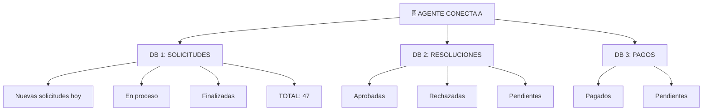

# Agente que Analiza Datos y Crea Reportes
## 🎯 Objetivo
Ver cómo un agente puede convertirse en tu analista de datos: recopila, procesa, analiza y comunica insights.
## 📖 Qué vamos a aprender
Tu director necesita saber:
- ¿Cómo está yendo la gestión de subvenciones este mes?
- ¿Hay algún patrón o anomalía?
- ¿Qué predice para próximo mes?
Hoy: Alguien pasa 8 horas generando un reporte.
Con agente: Se genera automáticamente cada noche.
## 📊 El Caso: Agente Analista de Subvenciones
### El Proceso Antes (Manual)
```
CADA LUNES 9:00
 Jefe de servicio: "Necesito reporte del mes anterior"
 Administrativo:
   Consulta BD (3 sistemas diferentes)
   Descarga datos a Excel
   Limpia: duplicados, errores de formato
   Calcula: totales, promedios, tendencias
   Genera gráficos (3-4 diferentes)
   Escribe análisis (¿qué significa?)
   Crea documento Word
   Envía por email
 Tiempo total: 8 horas
 Aciertos: ~85% (puede haber errores en cálculos)
 Frecuencia: Semanal (porque lleva trabajo)
RESULTADO: Director recibe reporte el martes,
           con 1 semana de retraso de datos
```
### El Proceso Después (Con Agente)
```
CADA DÍA A LAS 23:59
 Agente automáticamente:
   Conecta a BD 1 (solicit antidades)
   Conecta a BD 2 (resoluciones)
   Conecta a BD 3 (pagos)
   Extrae datos del DÍA
   Valida (duplicados, errores)
   Calcula: métricas, tendencias, comparativas
   Genera gráficos automáticamente
   Redacta resumen ejecutivo
   Identifica anomalías
   Envía por email
 Tiempo total: 3 minutos
 Aciertos: 100% (sin errores humanos)
 Frecuencia: DIARIA (siempre datos frescos)
RESULTADO: Director recibe reporte cada mañana
           con datos del día anterior
```
## 🔄 Flujo Detallado
### Paso 1: Recopilación de Datos

 Resultado: 23 resoluciones
Base de Datos 3: PAGOS
 Transferencias realizadas
 Importe total pagado
 Beneficiarios
 Resultado: €34.500 pagados
CONSOLIDADO: Todos los datos en una tabla unificada
```
### Paso 2: Limpieza y Validación
```
AGENTE REVISA:
¿Hay duplicados?
 Solicitud de Juan aparece 2 veces
 Agente elimina: 1 copia
 Resultado: 47 → 46 solicitudes válidas
¿Hay formatos inconsistentes?
 Algunos DNIs: "12345678-X"
 Otros: "12345678X"
 Agente normaliza: Todos "12345678-X"
¿Hay valores vacíos?
 3 solicitudes sin monto
 Agente alerta: "Revisar" (humano puede revisar)
RESULTADO: Datos limpios, listos para analizar
```
### Paso 3: Análisis y Cálculos
```
AGENTE CALCULA automáticamente:
MÉTRICAS BÁSICAS:
 Total solicitudes: 46
 Total aprox.: 23 (50%)
 Total rechazadas: 8 (17%)
 Total pendientes: 15 (33%)
 Monto promedio: €1.500
 Monto total aprobado: €34.500
 Tasa aprobación: 56,5%
ANÁLISIS COMPARATIVO:
 Vs semana anterior: +12% más solicitudes
 Vs mes anterior: -3% menos rechazo
 Vs año anterior: +25% crecimiento
 Tendencia: ↑ Subiendo
POR CATEGORÍA:
 Vivienda: 22 (48%)
 Comercio: 15 (33%)
 Otros: 9 (19%)
POR MUNICIPIO:
 Zona urbana: €24.000 (70%)
 Zona rural: €10.500 (30%)
```
### Paso 4: Detección de Anomalías
```
AGENTE REVISA PATRONES:
¿Hay algo inusual?
ANOMALÍA 1 DETECTADA:
 "Solicitante X ha presentado 5 solicitudes en 1 día"
 Normal: máx 2 por semana
 Acción: Alerta para revisar (posible error o abuso)
ANOMALÍA 2 DETECTADA:
 "Rechazo de solicitud de €50.000 (doble del promedio)"
 Asunto: Comercio (usualmente 70% aprobado)
 Esta vez: Rechazada
 Acción: Investigar motivo, ¿hay criterio nuevo?
ANOMALÍA 3 DETECTADA:
 "Procesamiento 10x más lento HOY"
 Promedio: 2 horas desde solicitud a resolución
 Hoy: 20 horas
 Causa potencial: ¿Sistema lento? ¿Ausencia de personal?
 Alerta: "Revisar cuellos de botella"
```
### Paso 5: Generación de Gráficos
```
AGENTE CREA automáticamente:
GRÁFICO 1: Embudo (Evolution)
   Solicitudes: 46     
   En proceso: 23      
   Aprobadas: 18       
   Pagadas: 15         
GRÁFICO 2: Distribución por tipo
  [Gráfico circular]
   Vivienda: 48%
   Comercio: 33%
   Otros: 19%
GRÁFICO 3: Tendencia
  [Gráfico línea]
  Semana 1: 30 solicitudes
  Semana 2: 35
  Semana 3: 46 ← HOY
  Tendencia: ↑ Crecimiento
```
### Paso 6: Redacción de Informe
```
AGENTE GENERA automáticamente:
---
RESUMEN EJECUTIVO - SUBVENCIONES JUNIO 2024
---
PERÍODO: 24-30 de junio
ACTIVIDAD PRINCIPAL:
✓ 46 solicitudes recibidas (+12% vs semana anterior)
✓ 23 solicitudes aprobadas (56,5% tasa de aprobación)
✓ €34.500 de subvenciones adjudicadas
DISTRIBUCIÓN:
- Vivienda: 48% (principal categoría)
- Comercio: 33%
- Otros: 19%
TENDENCIAS:
↑ Crecimiento del 25% respecto a año anterior
↓ Reducción de rechazo (-3% vs mes anterior)
⬜ Zona urbana concentra 70% del gasto
ANOMALÍAS DETECTADAS:
⚠ Solicitante X: 5 solicitudes en 1 día (investigar)
⚠ Rechazo inusualmente alto en una solicitud (revisar)
⚠ Tiempo de procesamiento 10x normal hoy (cuello botella)
PROYECCIÓN:
Con tendencia actual, esperar 50+ solicitudes próxima semana
ACCIÓN RECOMENDADA:
1. Investigar anomalías
2. Preparar personal para aumento
3. Revisar si criterios están siendo aplicados correctamente
---
```
### Paso 7: Envío y Notificación
```
CORREO GENERADO AUTOMÁTICAMENTE:
Para: Director
CC: Jefe de Servicio
Asunto: Informe Diario de Subvenciones - 30 junio
Cuerpo:
"Director,
Adjunto tu informe automático del día de hoy.
RESUMEN RÁPIDO:
- 46 solicitudes (+12%)
- 23 aprobadas (56,5%)
- €34.500 pagados
ANOMALÍAS: 3 detectadas (ver informe completo)
Acceso web: [link a dashboard interactivo]
---
Agente de Análisis
Procesado: 30 junio 23:59"
ADJUNTOS:
 Informe PDF completo
 Excel detallado con todos los datos
 Gráficos (PNG)
 Dashboard interactivo (para explorar datos)
```
## 📊 Impacto: De Intuición a Datos
```
ANTES:
- Director: "¿Cómo está esto yendo?"
- Admin: "Bien, me parece. Déjame verificar..."
- (Esperar 8 horas)
- Admin: "Eh, parece que está bien"
- Decisión: Basada en intuición + retraso de 1 semana
DESPUÉS:
- Director: Abre correo mañana
- Ve: Datos completos, actualizados, insights claros
- Nota: "Crecimiento +25%, pero anomalía en X"
- Decisión: Basada en datos reales, actuales
```
## 🎯 Ejercicio: Define Tus Reportes
**Proceso que necesita análisis**: ___________________________
1. **¿Qué datos necesitas?**
   - 
2. **¿Qué métricas son importantes?**
   - 
3. **¿Qué gráficos te ayudarían?**
   - 
4. **¿A quién le entregas?**
   - 
5. **¿Con qué frecuencia?**
   - 
<details>
  <summary>💡 Ejemplo: Reportes de Denuncias (haz clic para ver)</summary>
1. **¿Qué datos?**
   - Denuncias recibidas, clasificadas, resueltas
2. **¿Qué métricas?**
   - Total, por tipo, tiempo medio resolución, % resueltas
3. **¿Qué gráficos?**
   - Evolución semanal, distribución por tipo, tendencias
4. **¿A quién?**
   - Jefe de policía local, Director
5. **¿Frecuencia?**
   - Diaria (automático), semanal (presentación)
</details>
## 🚀 Reto Avanzado
**Predicción vs Análisis**:
Un agente que analiza puede también predecir:
```
ANÁLISIS HISTÓRICO:
- Junio: 180 solicitudes
- Julio: 220 solicitudes (+22%)
- Agosto: 280 solicitudes (+27%)
- Patrón: Crecimiento del 22-27% mes a mes
PREDICCIÓN:
- Septiembre (predicción): ~340-350 solicitudes (+22% a +27%)
RECOMENDACIÓN:
"Detectado patrón estacional. Septiembre probablemente
tenga 50% más solicitudes. Preparar recursos."
¿Cómo aprovecharías esto?
```
## ✅ Qué hemos aprendido
1. **Análisis automático**: El agente puede procesar múltiples BD
2. **Detección de anomalías**: Alerta sobre lo inusual
3. **Comunicación clara**: Informe legible para decisores
4. **Datos actualizados**: Cada día, no una vez a la semana
5. **Predicción posible**: Con patrón histórico
---
**Próximo paso**: Ahora que vimos agentes en acción en tu organización, ¿qué pasa si creas tu propio agente personal?

```