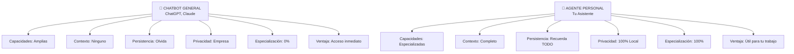

# Agentes Personales para Tu Trabajo Diario
## 🎯 Objetivo
Entender qué es un "agente personal" y cómo puede revolucionar tu día a día.
## 📖 Qué vamos a aprender
Has visto agentes que procesan solicitudes, atienden ciudadanos, generan reportes.
Todos ellos son agentes ORGANIZACIONALES. Viven en la institución, sirven a procesos.
Ahora: Los agentes PERSONALES. Tu asistente privado. Para TI.
## 🧑‍💼 Qué es un Agente Personal
Un **agente personal** es un asistente IA que:
- **Conoce tu contexto**: Tu puesto, tus tareas, tus procesos
- **Vive en tu computadora/nube**: Tu privacidad, tu control
- **Aprende de ti**: Mejora conforme te conoce
- **Te ahorra tiempo**: En tareas repetitivas, decisiones, investigación
- **Es tuyo**: No lo comparte nadie, solo tú decides
### Comparación: Asistente General vs Personal

## 💡 Casos de Uso: Tu Agente Personal
### Caso 1: Gestor de Calendario y Recordatorios
```
TÚ: "Tengo reunión con el director a las 10, 
     necesito resumir los últimos 3 meses de subvenciones"
AGENTE:
1. Accede a tu calendario: Ve reunión a las 10
2. Genera automáticamente:
   - Resumen último trimestre
   - Datos clave (total, promedio, tendencias)
   - Gráficos
   - "Puntos de atención" (anomalías)
3. A las 09:45: Te notifica con resumen
4. Durante reunión: Sugerencias en tiempo real
5. Después: Registra decisiones
```
### Caso 2: Redactor de Emails y Documentos
```
TÚ: "Necesito responder a este email de ciudadano quejándose"
AGENTE:
1. Lee el email del ciudadano
2. Consulta historial: Otros emails de esta persona
3. Entiende contexto: Queja anterior de hace 2 meses
4. Genera 3 opciones de respuesta:
   A) Formal y correctiva (reconocer error)
   B) Empática pero defensiva (explicar)
   C) Propositiva (solución)
5. TÚ eliges: "A, pero más corto"
6. AGENTE adapta
7. Resultado: Email listo, solo revisar
```
### Caso 3: Revisor de Documentos
```
TÚ: "Revisa este PDF de normativa actualizada. 
     ¿Qué cambió vs la anterior?"
AGENTE:
1. Lee PDF nuevo
2. Consulta su memoria: Normativa anterior de 3 meses atrás
3. Compara automáticamente
4. Genera report: "CAMBIOS DETECTADOS"
   - Artículo 5: Plazo de 10 → 15 días
   - Artículo 12: Eliminado criterio de edad
   - Nueva sección: Requisitos de accesibilidad
5. Impacto en tu trabajo:
   "Esto afecta a: Licencias y Subvenciones"
   Sugerencias: "Actualizar plantillas en: [links]"
   **RESULTADO:** Sabes impacto en 2 minutos (vs 30 minutos leyendo)
### Caso 4: Investigador de Datos
```
TÚ: "Este mes rechazamos 15% solicitudes. ¿Es normal? 
     ¿Hay patrón? ¿Debería preocuparme?"
Accede histórico: Últimos 12 meses
Analiza: Rechazo promedio 8%
Este mes: 15% (casi el doble)
**Investiga posibles causas:**
- Nueva normativa aplicada (SÍ desde hace 2 semanas)
- Personal diferente (NO, mismo equipo)
- Criterios más estrictos (SÍ, por normativa)
Conclusión: "Aumento esperado por normativa nueva"
Proyección: "Próximo mes probablemente 12-14%"
**AHORRO:** Análisis que tomaría 2 horas en 5 minutos
### Caso 5: Preparador de Presentaciones
```
TÚ: "En 2 horas tengo que presentar al concejal 
     sobre gestión de este semestre"
Accede datos: Tus KPIs, reportes, decisiones
**Genera automáticamente:**
- Estructura de presentación
- Diapos con datos actualizados
- Gráficos visuales
- "Story" - narrativa coherente
- Notas del orador (qué decir en cada slide)
- "Preguntas probables" (y respuestas)
TÚ personaliza (eres humano, tienes criterio)
A los 90 minutos: Presentación lista
Presentas con confianza: Todo está en las notas
## 🏢 Diferencia: Agentes Personales vs Organizacionales
```
AGENTE ORGANIZACIONAL (ya viste en casos prácticos)
 Vive: En servidor de la organización
 Controla: Procesos de toda la institución
 Acceso: Múltiples personas (pero restringido)
 Privacidad: Sujeto a auditoría organizacional
 Ejemplos: Agente de licencias, atención ciudadanos
AGENTE PERSONAL
 Vive: Tu computadora, tu nube personal
 Controla: Tu trabajo específico
 Acceso: Solo tú
 Privacidad: 100% privado (encriptado)
 Ejemplos: Tu asistente particular
```
## 🔐 Privacidad: Tu Agente Es Tuyo
Diferencia crítica:
```
CHATBOT PÚBLICO:
"Tus conversaciones pueden ser monitoreadas
 por la empresa que lo proporciona"
AGENTE PERSONAL:
"Tus datos se guardan en tu espacio cifrado.
 Ni siquiera la empresa proveedora ve tu información"
IMPLICACIÓN:
 Puedes compartir información sensible
 Tus decisiones quedan privadas
 Nadie más que tú ve tu contexto
 Confianza total en la herramienta
```
## 💰 Costo-Beneficio
```
SIN AGENTE PERSONAL:
 Tiempo en tarea 1 (email): 30 minutos/día
 Tiempo en tarea 2 (reportes): 2 horas/semana
 Tiempo en tarea 3 (revisión docs): 5 horas/mes
 TOTAL IMPRODUCTIVO: ~40 horas/mes
 En dinero: Si ganas €2.000/mes, son €1.300 en tiempo
 POR AÑO: €15.600 de tiempo perdido en tareas repetitivas
CON AGENTE PERSONAL (costo €50/mes):
 Tiempo en tarea 1: 5 minutos/día
 Tiempo en tarea 2: 30 minutos/semana
 Tiempo en tarea 3: 1 hora/mes
 TOTAL IMPRODUCTIVO: ~5 horas/mes
 Ahorrado: 35 horas/mes
 En dinero: ~€1.300/mes ahorrado
 POR AÑO: €15.600 - €600 coste = €15.000 NET
```
## 🎯 Ejercicio: Tu Agente Personal Ideal
Describe el agente que SÍ te ayudaría:
1. **¿Cuál es tu rol/puesto?**
   - 
2. **¿Qué 3 tareas repetitivas te consumen más tiempo?**
   - A) 
   - B) 
   - C) 
3. **¿Qué información necesita tu agente para ayudarte?**
   - 
4. **¿Qué decisiones te facilitaría?**
   - 
5. **¿Cuánto tiempo te ahorraría al mes?**
   - 
<details>
  <summary>💡 Ejemplo: Personal Administrativo (haz clic para ver)</summary>
1. **Rol**: Administrativo en Alcaldía
2. **Tareas que consumen tiempo**:
   - A) Responder emails repetitivos (1-2 horas/día)
   - B) Generar reportes semanales (4 horas/semana)
   - C) Revisar normativa actualizada (3 horas/mes)
3. **Información que necesita**:
   - Historial de emails (sabe qué respondo típicamente)
   - Datos de BD (para reportes automáticos)
   - Feeds de normativa (para alertas de cambios)
4. **Decisiones que facilitaría**:
   - "¿Debo responder esto o escalar?"
   - "¿Este documento es normativa actualizada?"
   - "¿Qué falta en este expediente?"
5. **Tiempo ahorrado**:
   - 60 horas/mes (basado en análisis anterior)
</details>
## 🚀 Reto Avanzado
**Ética del Agente Personal**:
Tu agente personal es TUYO. Privado. ¿Pero qué pasa si:
```
ESCENARIO A:
Tu agente aprende a reconocer cuándo algo es "fuera de norma"
Resultado: Sugerencias desviadas de la ley
ESCENARIO B:
Tu agente automatiza respuestas a ciudadanos
Pero no incluye información sobre recursos para vulnerable
ESCENARIO C:
Tu agente archiva decisiones que luego te preguntan
¿Qué decides hacer?
```
La privacidad es importante, pero también la responsabilidad. ¿Cómo lo equilibras?
## ✅ Qué hemos aprendido
1. **Agentes personales son diferentes**: Son para TI, no para la organización
2. **Privacidad completa**: Tus datos, tu control
3. **Especializados en tu trabajo**: Conocen tu contexto
4. **ROI claro**: Ahorran 30-40 horas/mes a muchas personas
5. **Ética importante**: Poder con responsabilidad
---
**Próximo paso**: Ahora conoceremos **OpenClaw**, una plataforma para crear estos agentes sin programación.

```