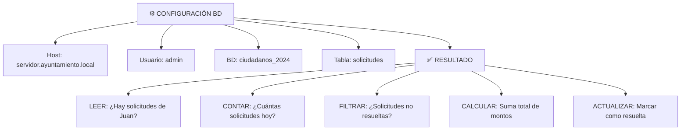
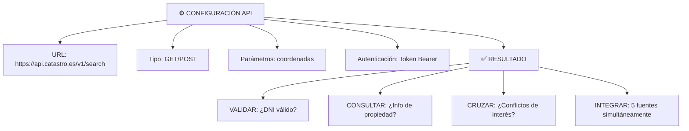

# Capacidades de OpenClaw

## 🎯 Objetivo

Entender exactamente qué puedes hacer con OpenClaw en términos técnicos y prácticos.

## 📖 Qué vamos a aprender

OpenClaw tiene 4 capacidades clave. Combinándolas, puedes crear prácticamente cualquier agente.

## 🔌 Capacidad 1: Conectar Bases de Datos

### Qué es
OpenClaw puede conectarse a cualquier base de datos:
- SQL Server (Microsoft)
- MySQL / PostgreSQL (Linux)
- Oracle
- Bases de datos en nube (AWS RDS, Azure SQL)

### Cómo funciona


### Caso de Uso
```
AGENTE: "Necesito información de solicitante"
USUARIO: "Juan García, DNI 12345678-X"
AGENTE: [Consulta BD]
        "Juan tiene 3 solicitudes:
         1. Subvención (€2.000, aprobada)
         2. Licencia (€0, en proceso)
         3. Ayuda (€500, rechazada)"
```

## 🔗 Capacidad 2: Integrar APIs Externas

### Qué es
OpenClaw puede llamar a cualquier API:
- Validación de DNI (AEAT)
- Información catastral
- Consulta de ASNEF
- APIs de otros municipios
- Servicios de email, SMS

### Cómo funciona


### Caso de Uso
```
USUARIO: "Procesa solicitud de vivienda de Ana"
AGENTE: [Llama a API AEAT]
        "¿DNI válido?" → SÍ ✓
        [Llama a API Catastro]
        "¿Información de la propiedad?" → Encontrada ✓
        [Llama a API ASNEF]
        "¿Sin deudas?" → SÍ ✓
        
RESULTADO: Validación completa en 5 segundos
```

## 📄 Capacidad 3: Procesar Archivos

### Qué es
OpenClaw puede leer, procesar y generar:
- PDFs (lectura OCR, extracción de texto)
- Excel (lectura/escritura de datos)
- Word (lectura, edición)
- Imágenes (OCR, análisis)

### Cómo funciona
```
CONFIGURACIÓN:
┌─ Carpeta origen: /solicitudes/entrada/
├─ Tipo de archivo: PDF
├─ Acción: OCR + Extracción
├─ Carpeta destino: /solicitudes/procesadas/
└─ Guardar resultado: Excel automático

RESULTADO:
El agente ahora puede:
├─ LEER: "¿Qué dice este PDF?"
├─ EXTRAER: "Nombre, DNI, monto"
├─ CLASIFICAR: "¿Qué tipo de documento?"
├─ GENERAR: "Crear Excel con resultados"
└─ ARCHIVAR: "Guardar en carpeta correcta"
```

### Caso de Uso
```
USUARIO: "Procesa carpeta de solicitudes"
AGENTE: [Detecta 50 PDFs en carpeta]
        Para cada PDF:
        ├─ Aplica OCR
        ├─ Extrae: nombre, DNI, monto, concepto
        ├─ Clasifica: Tipo de solicitud
        └─ Copia a carpeta procesada

RESULTADO: 50 PDFs procesados, Excel generado con datos
           Tiempo: 3 minutos (vs 5 horas manual)
```

## 💾 Capacidad 4: Programación en Memory (Sin Código)

### Qué es
OpenClaw permite crear lógica compleja SIN escribir código:
- Condicionales (SI...ENTONCES)
- Bucles (PARA CADA...)
- Cálculos (SUMA, PROMEDIO, etc.)
- Transformaciones de datos

### Cómo funciona
```
INTERFAZ VISUAL:
┌─ Bloque 1: Si monto > 5000
├─ Bloque 2: Entonces, escalar a Director
├─ Bloque 3: Sino, si monto > 1000
├─ Bloque 4: Entonces, necesita Jefe
├─ Bloque 5: Sino, automático
└─ Bloque 6: Fin

RESULTADO:
Lógica ejecutada automáticamente
Decisión correcta según reglas definidas
TODO en interfaz de bloques (visual)
```

### Caso de Uso
```
USUARIO: "Configura decisiones automáticas"
AGENTE: [Usuario arrastra bloques]
        1. Leer monto de solicitud
        2. Si € > 10.000:
           - Escalar a Director
        3. Si € 1.000-10.000:
           - Pedir aprobación de Jefe
        4. Si € < 1.000:
           - Aprobar automáti

RESULTADO: Agente toma decisiones según reglas
           Sin código, puro visual
```

## 🎯 Ejemplo Completo: Agente Integrado

```
CASO: Agente que procesa solicitudes de subvención

CAPACIDAD 1 - BD:
Conectar a: BD de ciudadanos, BD de solicitudes

CAPACIDAD 2 - API:
Integrar: API AEAT (validar ingresos), API Catastro

CAPACIDAD 3 - ARCHIVOS:
Procesar: PDFs de solicitud, generar Excel de resultado

CAPACIDAD 4 - LÓGICA:
┌─ Si monto > 50.000 → Escalar
├─ Si documentación incompleta → Solicitar
├─ Si eligible → Aprobar y pagar
└─ Si duda → Humano revisa

RESULTADO:
Usuario sube PDF de solicitud
↓
Agente: Lee PDF (OCR)
↓
Agente: Extrae datos (Capacidad 3)
↓
Agente: Consulta BD ciudadano (Capacidad 1)
↓
Agente: Valida con AEAT y Catastro (Capacidad 2)
↓
Agente: Aplica reglas de decisión (Capacidad 4)
↓
Agente: Genera resolución y actualiza BD
↓
Usuario: Recibe notificación con resultado
```

## 📊 Lo Que Puedes Lograr

Con estas 4 capacidades combinadas:

```
✓ Procesar 1.000+ documentos diarios
✓ Integrar 10+ fuentes de datos
✓ Tomar decisiones automáticas
✓ Generar reportes complejos
✓ Escalar cuando sea necesario
✓ Mantener datos actualizados
✓ Auditar cada acción

✗ Pero no:
- Casos más allá de lo imaginado
- Análisis predictivo avanzado (mejor Hermes)
- Sistemas con 100+ agentes coordinados
- Deep learning customizado
```

## 🎯 Ejercicio: Diseña tu Agente OpenClaw

Tu agente personal/departamental:

**Nombre**: ____________________________

1. **¿Qué BD necesita?**
   - 

2. **¿Qué APIs?**
   - 

3. **¿Qué archivos procesa?**
   - 

4. **¿Qué lógica necesita?**
   - 

<details>
  <summary>💡 Ejemplo: Agente de Normativa (haz clic para ver)</summary>

1. **BD**: Normativa (tabla de leyes vigentes)

2. **APIs**: BOE (consultar cambios legislativos), BOCM

3. **Archivos**: PDFs de normativa nueva

4. **Lógica**:
   - Si PDFes norma nueva:
     ├─ Buscar en BD si existe
     ├─ Si no existe: Agregar
     ├─ Comparar con anterior
     └─ Generar "cambios detectados"
     
Result: Agente que monitorea normativa automáticamente

</details>

## ✅ Qué hemos aprendido

1. **Capacidad 1 - BD**: Lee tus datos
2. **Capacidad 2 - APIs**: Integra sistemas externos
3. **Capacidad 3 - Archivos**: Procesa documentos
4. **Capacidad 4 - Lógica**: Toma decisiones
5. **Combinadas**: Casi todo es posible

---

**Próximo paso**: Casos reales donde OpenClaw está en uso.
