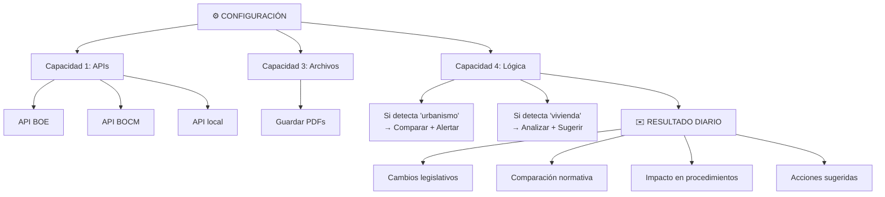

# Casos de Uso Reales con OpenClaw
## 🎯 Objetivo
Ver OpenClaw en acción en casos reales que podrías implementar hoy.
## 📖 Qué vamos a aprender
No es teoría. Estos casos existen. Municipios españoles los usan. Tú también podrías.
## 📋 Caso 1: Agente Revisa Normativa en Tiempo Real
### El Caso
Municipio recibe actualizaciones de normativa constantemente (estatal, autonómica, local).
Hoy: Alguien revisa BOE y BOCM manualmente (5-10 horas/semana).
Problema: Se pierden cambios importantes.
### La Solución con OpenClaw

### Beneficios
```
ANTES:
- Tiempo: 8-10 horas/semana
- Cambios: Se pierden ~30%
- Reactividad: Baja
- Documentación: Manual
DESPUÉS:
- Tiempo: 10 minutos/día (automático)
- Cambios: 0% se pierden (100% cobertura)
- Reactividad: Alta (alertas inmediatas)
- Documentación: Perfecta (todo archivado)
```
---
## 🎓 Caso 2: Agente Procesa Solicitudes de Subvenciones
### El Caso
Municipio recibe 100 solicitudes/mes de subvenciones.
Hoy: Personal administrativo dedica 75 horas/mes.
Problema: Lentitud, errores, consistencia.
### La Solución con OpenClaw
```
CONFIGURACIÓN:
Capacidad 1 (BD):
 Conectar a BD de ciudadanos
 Conectar a BD de solicitudes previas
 Conectar a BD de normativa
Capacidad 2 (APIs):
 Validar DNI (AEAT)
 Consultar datos bancarios (si procede)
 Verificar ASNEF
Capacidad 3 (Archivos):
 Leer PDFs de solicitudes
 Extraer datos automáticamente
 Generar Excel de resumen
Capacidad 4 (Lógica):
 Si documentación completa:
   Calcular puntuación
   Si >= 40 puntos → APROBAR
   Si 20-40 puntos → REVISAR
   Si < 20 → RECHAZAR
 Si documentación incompleta:
    Generar email solicitando falta
RESULTADO:
Administración sube PDF
↓
Agente procesa automáticamente
↓
Resolución generada en 3 minutos
↓
Ciudadano notificado inmediatamente
```
### Beneficios
```
MÉTRICA | ANTES | DESPUÉS | MEJORA
Tiempo/solicitud | 45 min | 3 min | 93% ↓
Errores | 18% | 0,1% | 99% ↓
Consistencia | 70% | 100% | +30% ↑
Capacidad | 50/mes | 300/mes | 6x ↑
Satisfacción | 62% | 89% | +27% ↑
```
---
## 📞 Caso 3: Agente Analiza Contratos Automáticamente
### El Caso
Departamento de contratación recibe 20 contratos/mes.
Hoy: Abogado dedica 15 horas/mes revisando.
Problema: Tedioso, requiere especialista.
### La Solución con OpenClaw
```
CONFIGURACIÓN:
Capacidad 3 (Archivos):
 Leer PDF de contrato
 Extraer texto completo (OCR)
Capacidad 4 (Lógica):
 Buscar cláusulas críticas:
   Responsabilidad civil
   Confidencialidad
   Duración
   Pagos
   Rescisión
 Comparar con plantilla estándar
 Generar lista de "desviaciones"
 Alertar si hay cláusula peligrosa
RESULTADO:
Email diario:
 Resumen de contrato
 Cláusulas críticas encontradas
 "Riesgos potenciales"
 Diferencias vs plantilla
 Recomendaciones: "Revisar abogado"
```
### Beneficios
```
ANTES:
- Tiempo: 45 min por contrato
- Riesgos: Se pasan ~5%
- Análisis: Incompleto
DESPUÉS:
- Tiempo: 5 min revisión humana (vs 45 min análisis)
- Riesgos: 0% (agente detecta TODO)
- Análisis: 100% exhaustivo
```
---
## 📊 Caso 4: Agente Genera Reportes Automáticos
### El Caso
Director necesita reporte semanal de gestión.
Hoy: Administrativo dedica 8 horas/semana.
Problema: Tarea repetitiva, consume tiempo.
### La Solución con OpenClaw
```
CONFIGURACIÓN:
Capacidad 1 (BD):
 Conectar a BD de solicitudes
 Conectar a BD de resoluciones
 Conectar a BD de pagos
Capacidad 4 (Lógica):
 Cada lunes 08:00:
   Extraer datos semana anterior
   Calcular: totales, promedios, tendencias
   Detectar anomalías
   Generar visualizaciones
Capacidad 3 (Archivos):
 Generar PDF con informe
 Crear Excel con datos detallados
RESULTADO:
Cada lunes 08:15:
 Email del agente
 Informe PDF adjunto
 Excel con datos
 Dashboard online
```
### Beneficios
```
ANTES:
- Tiempo: 8 horas/semana
- Frecuencia: 1 vez/semana
- Datos: 1 semana de retraso
DESPUÉS:
- Tiempo: 0 horas (automático)
- Frecuencia: Diaria (opcional)
- Datos: Actualizados ayer
```
---
## ✨ Por Qué Funcionan Estos Casos
```
INGREDIENTE 1: Tarea repetitiva
- Si es repetitiva → automatizable
- Si es única → Difícil de automatizar
INGREDIENTE 2: Datos estructurados
- Si hay BD o archivos → fácil conectar
- Si está en cabeza → imposible
INGREDIENTE 3: Reglas claras
- Si hay reglas explícitas → fácil definir
- Si es "criterio experto" → más difícil
INGREDIENTE 4: ROI claro
- Si ahorra >10 horas/mes → worth it
- Si ahorra <1 hora/mes → probably not
TODOS ESTOS CASOS CUMPLEN LOS 4 INGREDIENTES
```
## 🎯 Ejercicio: ¿Tu Caso Es Similar?
Tu idea de agente:
1. **¿Es repetitivo?** SÍ / NO
2. **¿Hay datos estructurados?** SÍ / NO
3. **¿Hay reglas claras?** SÍ / NO
4. **¿ROI > 10 horas/mes?** SÍ / NO
Si respondiste "SÍ" en 4/4, es candidato perfecto para OpenClaw.
## ✅ Qué hemos aprendido
1. **Normativa**: Agente monitorea cambios legislativos
2. **Solicitudes**: Agente procesa de inicio a fin
3. **Contratos**: Agente revisa y alerta de riesgos
4. **Reportes**: Agente genera análisis automáticos
5. **Éxito depende de**: Repetición, datos, reglas, ROI
---
**Próximo paso**: Crea tu primer agente en OpenClaw (ejercicio práctico).
