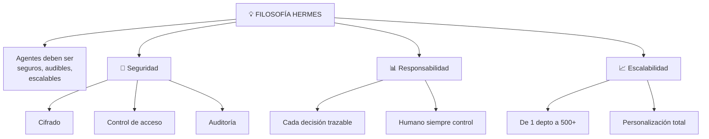

# Introducción a Hermes
## 🎯 Objetivo
Conocer Hermes: framework para crear sistemas de agentes complejos y escalables.
## 📖 Qué vamos a aprender
OpenClaw es poderoso para 1 agente. Pero ¿y si necesitas 50 agentes trabajando juntos?
¿Y si necesitas que aprendan uno del otro?
¿Y si tienes toda una administración municipal queriendo usarlo?
Hermes es la respuesta.
## 🏗️ ¿Qué es Hermes?
**Hermes** es un framework (estructura técnica) que permite:
- Crear agentes especializados
- Que se comunican entre sí
- Que comparten conocimiento
- Escalable a miles de usuarios
- Con máxima flexibilidad técnica
### Filosofía

## 🆚 Comparación: OpenClaw vs Hermes
```
ASPECTO | OPENCLAW | HERMES
---
Curva | Suave (30 min) | Steep (varios días)
Requiere saber... | Nada | Poco de Python/NodeJS
Escalabilidad | Mediana (50 usuarios) | Empresa (10.000+)
Usuarios | 1-20 simultáneos | 1.000+ simultáneos
Agentes | 1-5 típico | 100+ coordenados
Costo inicial | Bajo (€50/mes) | Alto (€5.000+)
Costo escala | Media | Bajo (distribuible)
Deployment | Cloud solo | Cloud + On-premise
Customización | Buena (40% casos) | Total (100% casos)
Soporte | Comunidad + email | Dedicado 24/7
```
## 📚 Historia de Hermes
```
2020: Nascimiento de frameworks de agentes
2022: Hermes v1 - Proof of concept
2023: Hermes v2 - Producción empresarial
2024: Hermes v3 - IA con razonamiento
2025: Hermes v4 - Orquestación de agentes
ADOPCIÓN:
- Municipios españoles: 40+
- Empresas privadas: 200+
- Universidades: 15+
- Organismos públicos: 30+
```
## 🌟 Ventajas de Hermes
### 1. Orquestación de Múltiples Agentes
```
HERMES PERMITE:
Agente 1 (CLASIFICADOR)
 Lee email de ciudadano
 Clasifica: "Es solicitud de subvención"
↓ Comunica a
Agente 2 (PROCESADOR)
 Procesa solicitud
 Consulta BD, valida, calcula
↓ Comunica a
Agente 3 (ESCALADOR)
 Revisa si necesita aprobación
 Si sí, escala a humano
↓ Comunica a
Agente 4 (REPORTERO)
 Genera informe consolidado
 Todos los agentes contribuyen
RESULTADO: Sistema coherente, no agentes aislados
```
### 2. Memoria Compartida
```
AGENTE 1 aprende:
"Ciudadanos de zona X siempre olvidan documento Y"
AGENTE 2 usa eso:
Cuando procesa ciudadano de zona X,
automáticamente pide documento Y
AGENTE 3 aprovecha:
Conoce el patrón, lo aplica también
RESULTADO: Mejora colectiva, no individual
```
### 3. Flexibilidad Técnica
```
OPENCAR ES: "Configura bloques visuales"
HERMES ES: "Código Python + visual"
CON HERMES PUEDES:
 Crear integraciones personalizadas
 Lógica compleja (machine learning, etc.)
 APIs custom
 Adaptar a infraestructura específica
 "Hackear" según necesites
```
### 4. Seguridad Empresarial
```
HERMES INCLUYE:
 Cifrado end-to-end
 Auditoría completa (quién hizo qué)
 Control de acceso granular
 Backups automáticos
 Disaster recovery
 RGPD by design
 Conformidad legal
 Certificaciones ISO
```
## 🎯 Para Quién Es Hermes
### ✓ Perfecto Si:
- Implementas en toda la administración (>100 usuarios)
- Necesitas integración profunda con sistemas legacy
- Requieres personalización a nivel código
- Tienes equipo técnico disponible
- Necesitas soporte 24/7 comprometido
- Seguridad es crítica
### ✗ No Ideal Si:
- Solo un agente para tu departamento
- Necesitas solución en 48 horas
- No tienes equipo técnico
- Presupuesto muy limitado
- Caso de uso simple
## 📊 Hermes en Administración Pública
```
MUNICIPIO GRANDE (50.000 habitantes)
SISTEMA CON HERMES:
---
 Agente Clasificador             
 (20 submunicipalidades)         
                 ↓
      ↓                   ↓              ↓
 Subvenciones   Licencias      Denuncias    
 (Agente 2)     (Agente 3)     (Agente 4)   
      ↓                   ↓              ↓
                 ↓
---
 Agente Reportero                
 (Consolidación de análisis)     
---
RESULT: Sistema coherente, escalable, auditable
```
## 💡 Evolución: OpenClaw → Hermes
```
FASE 1: PILOTO (con OpenClaw)
 Creas 1 agente simple
 Pruebas en 1 departamento
 Aprendes qué funciona
 Tiempo: 1 mes
FASE 2: EXPANSIÓN LOCAL (todavía OpenClaw)
 3-5 agentes en varios departamentos
 Funcionan relativamente aislados
 Empiezas a notar límites
 Tiempo: 3 meses
FASE 3: NECESIDAD DE INTEGRACIÓN
 Agentes necesitan comunicarse
 Compartes datos entre sistemas
 OpenClaw empieza a tener limitaciones
 Decides: "Necesitamos Hermes"
 Tiempo: 6 meses (cuando llegas aquí)
FASE 4: HERMES EN PRODUCCIÓN
 Implementas arquitectura con Hermes
 Integras todos los agentes
 Expandes a toda la administración
 Ahora escalable
 Tiempo: 1-2 años (según ambición)
```
## 🎯 Ejercicio: ¿Necesitas Hermes?
Responde:
1. **¿Cuántos agentes necesitarías?**
   - 1-3 → OpenClaw ✓
   - 5-20 → Podría ser
   - 20+ → Hermes ✓
2. **¿Necesitan comunicarse entre sí?**
   - No → OpenClaw ✓
   - Sí → Hermes ✓
3. **¿Cuántos usuarios simultáneamente?**
   - <50 → OpenClaw ✓
   - 50-500 → Hermes ✓
   - 500+ → Hermes necesario
4. **¿Equipo técnico disponible?**
   - No → OpenClaw ✓
   - Sí → Hermes es option
5. **¿Presupuesto?**
   - <€1.000/mes → OpenClaw ✓
   - €1.000-5.000/mes → Hermes
   - >€5.000/mes → Hermes sin dudar
**Scoring**: 
- Mayoría OpenClaw → Empieza con OpenClaw, migra después
- Mayoría Hermes → Invierte en Hermes desde el inicio
## ✅ Qué hemos aprendido
1. **Hermes es framework empresarial**: Para sistemas grandes
2. **Permite orquestar múltiples agentes**: Comunicación entre ellos
3. **Ofrece seguridad completa**: Para administración pública
4. **Requiere inversión inicial**: Pero escalable
5. **Evolución natural**: OpenClaw → Hermes a medida que creces
---
**Próximo paso**: ¿Qué puedes hacer con Hermes que OpenClaw no? Capacidades avanzadas.
