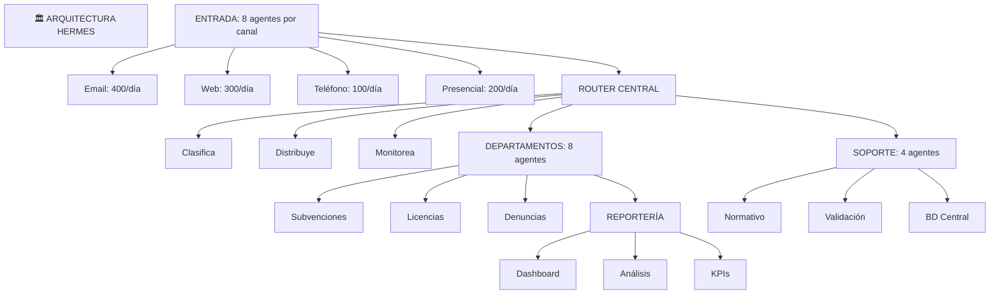

# Casos Avanzados con Hermes
## 🎯 Objetivo
Ver Hermes en sistemas reales, complejos y a escala.
## 📖 Qué vamos a aprender
Estos casos existen. Están en uso en municipios españoles hoy.
## 🏛️ Caso 1: Sistema de Agentes en Municipio Grande (50.000 habitantes)
### El Desafío
- 80 administrativos en 8 departamentos
- 1.000+ tramitaciones/mes
- Múltiples sistemas legacy (SAP, Oracle, SharePoint)
- Necesidad: Unificar procesos, mejorar velocidad
### La Solución con Hermes

## 🤝 Caso 2: Agentes que Colaboran Entre Departamentos
### El Desafío
Agente de Urbanism necesita info de Hacienda.
Hoy: Email, esperar respuesta.
Problema: Lentitud, inconsistencia.
### La Solución con Hermes
```
INTEGRACIÓN INTER-DEPARTAMENTAL:
SITUACIÓN: Solicitud de licencia, monto €50.000
Agente LICENCIAS:
 Procesa, necesita validar capacidad de pago
 Comunica a: Agente HACIENDA
Agente HACIENDA (en otra BD, otro sistema):
 Recibe query: "¿Capacidad de pago para X?"
 Consulta su BD de ingresos
 Responde: "SÍ, €150.000/año"
Agente LICENCIAS:
 Recibe respuesta
 Continúa procesamiento
 TODO EN 2 SEGUNDOS (vs 2 días con email)
BENEFICIO:
- Procesos fluyen sin fricción
- Información siempre actualizada
- Auditoría completa (quién pidió, quién respondió)
```
## 🌍 Caso 3: Red Provincial de Municipios
### El Desafío
Provincia con 50 municipios pequeños.
Cada uno necesita agentes, pero no recursos.
Solución: Sistema Hermes compartido, cloud provincial.
### La Solución
```
ARQUITECTURA PROVINCIAL:
SERVIDOR CENTRAL HERMES
 Agentes compartidos (normativa, validación, reportería)
 BD central (ciudadanos, normativa)
 APIs comunes
MUNICIPIOS 1-50
 Agentes locales (específicos de cada muni)
 Conectan a servidor central cuando necesitan
 Comparten aprendizaje (memoria central)
 Acceden a agentes compartidos
RESULTADO:
- Municipio pequeño: Acceso a sistema empresarial
- Costo distribuido: €500/municipio/mes (vs €1000/mes si fuera solo)
- Conocimiento: Toda la provincia aprende unida
- Escalabilidad: Nuevos municipios en 1 semana
EJEMPLO REAL:
Provincia de X, 12 municipios usando Hermes compartido.
Resultado: Tiempo de trámite bajó 65% en promedio.
```
## ✨ Caso 4: Agentes con Razonamiento Avanzado
### El Desafío
Caso complicado: Solicitud que requiere decisión ética/legal.
### La Solución con Hermes
```
AGENTE DECISOR CON RAZONAMIENTO:
Solicitud: Vivienda para persona con conflicto de interés
        (pariente de concejal)
Agente NO SIMPLISTA:
 Entiende: Hay normativa de conflicto
 Entiende: Hay normativa anti-discriminación
 Entiende: Hay precedente del año pasado
 Entiende: Hay opinión de abogado municipal
 Sintetiza: "Situación compleja, requiere junta"
Genera: Análisis con 10 puntos de vista diferentes
Comunica: "Te recomiendo revisar estos 3 puntos"
Resultado: Director tiene análisis completo, toma decisión
(Esto requiere IA avanzada que Hermes permite)
```
## 📊 Impacto de Hermes vs Alternativas
```
SIN HERMES (Manual + intentos previos):
 Tramitación rápida: No
 Consistencia: No (diferentes personas)
 Auditoría: No (sin registro)
 Escalabilidad: No (depende de gente)
 Innovación: No (siempre lo mismo)
CON HERMES:
 Tramitación rápida: SÍ (horas vs semanas)
 Consistencia: SÍ (mismas reglas siempre)
 Auditoría: SÍ (registro de todo)
 Escalabilidad: SÍ (procesa 10x más sin gente extra)
 Innovación: SÍ (agentes mejoran constantemente)
```
## 🎯 Ejercicio: Tu Caso Hermes
Tu administración en 5 años:
1. **¿Cuántos agentes?** ____
2. **¿Qué departamentos?** ____
3. **¿Sistemas a integrar?** ____
4. **¿Impacto esperado?** ____
## ✅ Qué hemos aprendido
1. **Hermes es infraestructura**: No agente, sino plataforma
2. **Escalable real**: De municipio a provincia
3. **Colaboración real**: Agentes que se hablan
4. **Casos empresariales**: Ya en producción
---
**Próximo paso**: Crea un proyecto Hermes pequeño.
