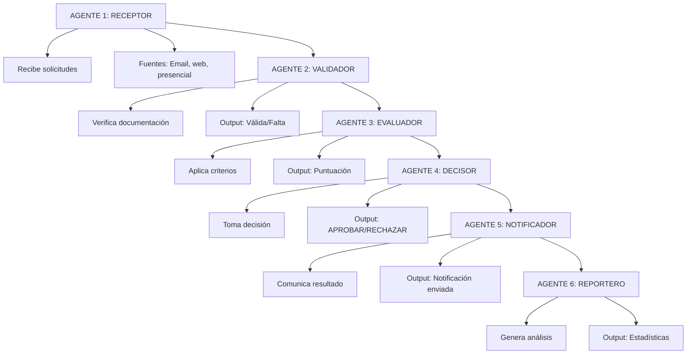
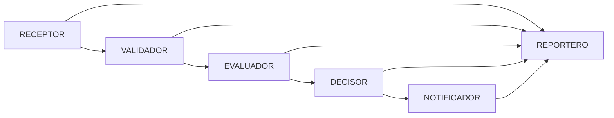
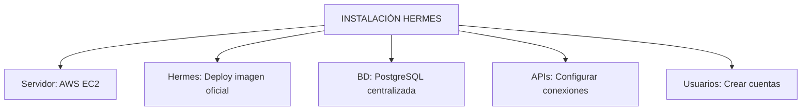
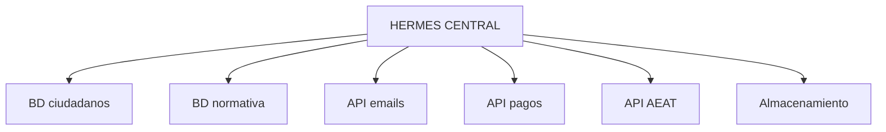

# Proyecto: Sistema de Agentes con Hermes

## 🎯 Objetivo

Diseñar un sistema de agentes con Hermes para un departamento municipal.

## 📖 Qué vamos a hacer

Proyecto: **Red de Agentes para Gestión de Subvenciones Municipales**

Este es el proyecto que un municipio implementaría de verdad.

## 🎯 Fase 1: Planificación (Semana 1)

### Define Agentes Necesarios



### Mapea Dependencias



## 🔧 Fase 2: Infraestructura (Semana 2-3)

### Setup Hermes



### Conecta Sistemas


```

## 🤖 Fase 3: Desarrollo de Agentes (Semana 4-6)

### Agente Receptor

```
PSEUDOCÓDIGO:

def receptor_email(email):
    ├─ Parsea email
    ├─ Extrae datos clave
    ├─ Crea solicitud en BD
    ├─ Comunica a: VALIDADOR
    └─ Registra: email recibido

def receptor_web(form):
    ├─ Recibe datos del formulario
    ├─ Valida formato básico
    ├─ Crea solicitud en BD
    ├─ Comunica a: VALIDADOR
    └─ Envía confirmación a ciudadano
```

### Agente Validador

```
def validador(solicitud_id):
    ├─ Obtiene solicitud
    ├─ Verifica documentos adjuntos
    ├─ Compara con checklist
    ├─ SI completa:
    │  ├─ Status = "VALIDADA"
    │  └─ Comunica a: EVALUADOR
    ├─ SI incompleta:
    │  ├─ Identifica falta
    │  ├─ Status = "PENDIENTE_DOCS"
    │  └─ Notifica ciudadano
    └─ Registra: qué falta
```

### Agente Evaluador

```
def evaluador(solicitud_id):
    ├─ Obtiene solicitud
    ├─ Consulta normativa
    ├─ Aplica criterios:
    │  ├─ Ingresos: +X puntos
    │  ├─ Zona: +Y puntos
    │  └─ Otros: +Z puntos
    ├─ Total: A puntos
    ├─ Status = "EVALUADA"
    ├─ Comunica a: DECISOR
    └─ Registra: puntuación y criterios aplicados
```

### Agente Decisor

```
def decisor(solicitud_id):
    ├─ Obtiene evaluación
    ├─ Lee puntuación
    ├─ IF puntuación >= 40:
    │  ├─ Decisión = "APROBAR"
    │  ├─ Monto = calcular_monto(puntuación)
    │  └─ Comunica a: NOTIFICADOR
    ├─ ELSE:
    │  ├─ Decisión = "RECHAZAR"
    │  └─ Comunica a: NOTIFICADOR
    └─ Registra: decisión + justificación
```

### Agente Notificador

```
def notificador(solicitud_id):
    ├─ Obtiene decisión
    ├─ Genera resolución (PDF)
    ├─ Si APROBADA:
    │  ├─ Envía email: "Felicidades, aprobada"
    │  ├─ Adjunta resolución
    │  └─ Inicia pago
    ├─ Si RECHAZADA:
    │  ├─ Envía email: "Ha sido rechazada"
    │  ├─ Explica motivo
    │  └─ Ofrece recurso
    └─ Registra: notificación enviada
```

### Agente Reportero

```
def reportero():
    ├─ Cada lunes 08:00:
    ├─ Extrae datos última semana
    ├─ Calcula:
    │  ├─ Total solicitudes: 45
    │  ├─ Aprobadas: 28 (62%)
    │  ├─ Rechazadas: 12 (27%)
    │  ├─ Pendientes: 5 (11%)
    │  └─ Monto total: €67.500
    ├─ Genera gráficos
    ├─ Redacta informe
    └─ Envía a: Director
```

## 🧪 Fase 4: Testing (Semana 7)

### Pruebas

```
PRUEBA 1: Solicitud Completa
├─ Resultado: OK ✓

PRUEBA 2: Solicitud Incompleta
├─ Resultado: Agente pide documentos ✓

PRUEBA 3: Solicitud Rechazable
├─ Resultado: Agente rechaza ✓

PRUEBA 4: Comunicación Entre Agentes
├─ Resultado: Pasan datos correctamente ✓

PRUEBA 5: Reporte Generado
├─ Resultado: Datos correctos ✓

TESTS: 5/5 pasados ✓
```

## 🚀 Fase 5: Deployment (Semana 8)

### Go Live

```
1. Capacitación: Personal aprende usar sistema
2. Migración: Trasferir solicitudes previas
3. Cutover: Cambiar de manual a agentes
4. Monitoreo: Primera semana = vigilancia cercana
5. Ajustes: Cambios según feedback
```

## 📊 Fase 6: Operación (Semana 9+)

### Métricas

```
ANTES:
├─ Tramitaciones/mes: 100
├─ Tiempo promedio: 10 días
├─ Error rate: 8%
├─ Horas personal: 200/mes

DESPUÉS (mes 1):
├─ Tramitaciones/mes: 120
├─ Tiempo promedio: 5 días
├─ Error rate: 0,1%
├─ Horas personal: 100/mes

MEJORA:
├─ Velocidad: 50% ↑
├─ Calidad: 99% ↑
├─ Eficiencia: 50% ↑
```

## 💰 Presupuesto Estimado

```
INVERSIÓN INICIAL:
├─ Hermes license: €5.000
├─ Servidor: €3.000
├─ Desarrollo (100h @ €100): €10.000
├─ Capacitación: €2.000
└─ Contingencia (10%): €2.000
TOTAL: €22.000

OPERACIÓN ANUAL:
├─ Hermes: €15.000
├─ Servidor: €3.600
├─ Soporte: €5.000
└─ Mejoras: €3.000
TOTAL: €26.600

ROI:
├─ Ahorros personal: 100h/mes × €30 = €3.000/mes = €36.000/año
├─ Reducción errores: €5.000/año
└─ TOTAL AHORROS: €41.000/año

GANANCIA: €41.000 - €26.600 = €14.400/año
PAYBACK: 5-6 meses
```

## ✅ Qué hemos aprendido

1. **Hermes requiere planificación**: 8 fases bien definidas
2. **Agentes se comunican**: No aislados
3. **Proyecto es alcanzable**: Con timeline realista
4. **ROI es positivo**: Se recupera inversión en 6 meses
5. **Operación escala**: Mejora constante

---

**Próximo paso**: El futuro. Tendencias en IA Agéntica.
