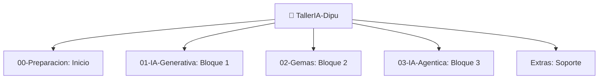

# ✨ Troubleshooting: Resuelve Problemas Comunes

**Guía rápida para problemas técnicos y errores durante el taller**

---

## 🔧 Problemas de Acceso

### "No puedo iniciar sesión en ChatGPT/Claude"

**Error típico:**
```
❌ "Invalid email" o "Something went wrong"
```

**Soluciones:**
1. Limpia cookies: `Ctrl+Shift+Supr`
2. Abre ventana privada/incógnito
3. Intenta otro navegador
4. Verifica que el email esté correcto (sin espacios)
5. Si es Gmail, asegúrate de tener 2FA activado

**Si nada funciona:**
- Intenta con otro email
- Usa registro con Google/Microsoft
- Espera 1 hora y reintenta

---

### "La web se carga lentamente o no carga"

**Causas posibles:**
- Conexión lenta
- Navegador con muchas extensiones
- Servidor sobrecargado

**Soluciones:**
1. Recarga la página (F5)
2. Desactiva extensiones del navegador
3. Usa otra red WiFi si es posible
4. Intenta a otra hora (servidores menos cargados)

**Consejo:** Usa navegación privada (sin extensiones)

---

## 💬 Problemas Con Prompts

### "La IA no entiende lo que quiero"

**Diagnóstico:** El prompt es demasiado vago.

**Pasos:**
1. ¿Es un término específico? → Define explícitamente
2. ¿Tienes contexto? → Agrégalo al inicio
3. ¿Esperas formato específico? → Pídelo

**Antes:**
```
¿Cómo redacto una resolución?
```

**Después:**
```
Eres experto en redacción administrativa municipal.
Redacta una RESOLUCIÓN que deniegue una solicitud de licencia de obras.
Contexto: La solicitud es por un café en zona residencial.
Formato: Numeración oficial, párrafos claros, pie de firma.
```

---

### "La respuesta está incompleta"

**Causa:** Alcanzó el límite de tokens.

**Solución:**
```text
Continúa desde donde te cortaste
```

O si está muy mal:
```text
Empieza de nuevo pero divide en 3 partes
```

---

### "Siempre me da la misma respuesta"

**Posibles causas:**
- Temperatura muy baja (modo determinista)
- Contexto muy restrictivo
- Modelo necesita "descanso"

**Soluciones:**
1. Pide: "Dame 3 alternativas diferentes"
2. Modifica ligeramente el prompt
3. Abre nueva conversación
4. Intenta otro modelo (Claude en lugar de ChatGPT)

---

### "La respuesta es completamente incorrecta"

**Esto es NORMAL.** La IA alucina.

**Diagnóstico:**
- ¿El prompt era claro? Si no → Mejóralo
- ¿Diste ejemplos? Si no → Agrégalos
- ¿Es tema muy nuevo? IA no tiene datos → Explica más

**Acción:**
```text
Te equivocaste en [punto específico].
Corrección: [información correcta].
Ahora intenta de nuevo.
```

---

## 📊 Problemas Con Excel/Sheets

### "La fórmula no funciona"

**Pasos de diagnosis:**
1. ¿El símbolo `=` está al inicio? 
2. ¿Los rangos existen? (ej: A1:A10)
3. ¿Los tipos de datos son correctos? (números, no texto)
4. ¿Hay referencias circulares? (=A1 en A1)

**Error comum:**
```
❌ =SUMA(A1:A10)  (si es Excel español)
✅ =SUM(A1:A10)   (si es Sheets)
❌ =SUM("A1:A10") (las comillas rompen todo)
```

---

### "Mi fórmula da #ERROR, #VALUE!, #DIV/0!, etc"

**Significados:**

| Error | Causa | Solución |
|-------|-------|----------|
| `#ERROR!` | Fórmula inválida | Revisa sintaxis |
| `#VALUE!` | Tipo de dato incorrecto | ¿Hay números o texto? |
| `#DIV/0!` | División por cero | Valida el divisor |
| `#REF!` | Referencia no existe | Restaura la celda |
| `#NAME?` | Nombre de función invalido | Revisa nombre función |
| `#N/A` | Valor no encontrado | BUSCARV no halló valor |

**Solución universal:**
```
=IFERROR(fórmula_original; 0)
```

Esto devuelve 0 si hay error. (Úsalo con cuidado)

---

### "Sheets es más lento que Excel"

**Normal.** Es web vs desktop.

**Mejoras:**
- Cierra otras pestañas
- Reduce el número de filas/columnas
- Guarda más frecuentemente
- Usa Ctrl+S

---

## 🎯 Problemas Durante Ejercicios

### "No sé por dónde empezar"

**Pasos:**
1. Lee el objetivo 2 veces
2. Busca palabras clave en el Glosario
3. Mira el ejemplo guiado
4. Intenta el primer paso
5. Si aún no entiende → Mira la solución

**No es vergüenza:** Ver la solución DESPUÉS de intentar es aprendizaje legítimo.

---

### "Mi solución es diferente a la sugerida"

**Eso está BIEN.** Hay múltiples formas correctas.

**Verifica:**
- ¿Producen el mismo resultado? → OK
- ¿Es más eficiente? → Mejor aún
- ¿Es más legible? → Excelente

**Solo preocúpate si:** No funciona o da error.

---

### "Me atasco completamente"

**Acción de emergencia:**
1. Toma 5 minutos de descanso
2. Lee la solución sugerida (completamente)
3. Intenta ENTENDER por qué funciona
4. Vuelve a tu problema desde una ángulo diferente

**Consejo:** A veces los mejores insights vienen después de una pausa.

---

## 🛡️ Problemas de Seguridad/Privacidad

### "¿Es seguro compartir datos en ChatGPT?"

**Respuesta:** DEPENDE.

**SEGURO compartir:**
- Procesos generales sin datos sensibles
- Ejemplos anonimizados
- Normativa pública
- Lenguaje genérico

**NO compartir:**
- DNI, NIF, datos personales
- Información confidencial
- Datos de ciudadanos
- Contraseñas o credenciales

**Regla de oro:** Si no lo dirías en voz alta en la cafetería, no lo escribas en IA.

---

### "¿Quién ve mis conversaciones?"

**ChatGPT:**
- OpenAI las guarda
- Revisores internos pueden verlas
- Datos pueden usarse para entrenar (opt-in)
- Puedes pedir que las borren

**Claude:**
- Anthropic las guarda
- Mejor privacidad que OpenAI (generalmente)
- Puedes solicitar eliminación

**Google Gemini:**
- Google las guarda
- Integradas a tu cuenta Google
- Sincronizadas entre dispositivos

---

### "¿Cómo protejo información sensible?"

**Opciones:**
1. **Generaliza:** En lugar de "María García", di "un ciudadano"
2. **Anonimiza:** En lugar de "expediente 2024/1234", di "un expediente típico"
3. **Abstrae:** Cambia números: "un presupuesto de 50k" en lugar del real
4. **Divide:** Haz dos prompts separados sin vincular información

**Ejemplo:**
```
❌ Malo: "Analiza este contrato para la empresa XYZ que vimos ayer"
✅ Bien: "Analiza este contrato de prestación de servicios genérico"
```

---

## 🔄 Problemas de Navegación

### "Me pierdo en la estructura de carpetas"

**Orientación:**


 ├─ README.md        ← Comienza aquí
 ├─ SETUP.md         ← Si falta herramientas
 ├─ 01-IA-Generativa
 │  └─ README.md     ← Mapa del Bloque 1
 ├─ 02-Gemas
 │  └─ README.md     ← Mapa del Bloque 2
 ├─ 03-IA-Agentica
 │  └─ README.md     ← Mapa del Bloque 3
 └─ Extras
    ├─ Glosario.md   ← Términos desconocidos
    ├─ FAQ.md        ← Preguntas frecuentes
    └─ Este archivo
```

**Truco:** Los READMEs son tus mapas. Léélos primero.

---

### "¿Debo hacer todo en orden?"

**Respuesta corta:** Preferentemente sí.

**Respuesta larga:**
- **Principiantes:** Sigue el orden
- **Intermedios:** Puedes saltarte "Conceptos básicos"
- **Expertos:** Ve directo a "Método Karpathy" o "Gemas"

---

## 📱 Problemas de Plataforma

### "¿Funciona en móvil?"

**Respuesta:**
- **Leer documentos:** Sí
- **Hacer ejercicios:** Difícil (pantalla pequeña)
- **Escribir en Excel:** No recomendado

**Recomendación:** PC/laptop para lo práctico, móvil para leer.

---

### "¿Qué navegador debo usar?"

**Ranking:**
1. 🥇 **Chrome** - Mejor compatibilidad
2. 🥈 **Firefox** - Privacidad, buena compatibilidad
3. 🥉 **Edge** - Integración Windows
4. ⚠️ **Safari** - Limitaciones con algunas herramientas

---

## ⚠️ Problemas Conceptuales

### "No entiendo qué es una Gema"

**Analogía:**
```
Prompt = Preguntarle algo a un experto genérico
Gema = Un experto que además conoce TODO tu contexto
```

**Ejemplo:**
```
Chatbot genérico: "¿Cuáles son los plazos administrativos?"
               → Respuesta genérica de 10 segundos

Gema especializada: "¿Cuáles son los plazos administrativos?"
                → Respuesta basada en tu municipalidad específica
```

---

### "¿Para qué sirve un Agente?"

**Respuesta simple:**

```
Prompt: Tú das órdenes, IA responde
Agente: Tú dices objetivo, IA planifica y ejecuta todo sola
```

---

## 🆘 Último Recurso

### "Nada de esto funciona"

**Pasos finales:**
1. Reinicia el navegador completamente
2. Limpia caché: `Ctrl+Shift+Supr`
3. Intenta otro navegador
4. Desconecta VPN si la tienes
5. Prueba con data móvil en lugar de WiFi
6. Espera 1 hora y reintenta

### "Sigo sin poder"

**Opciones:**
- Levanta la mano en el taller presencial
- Pide ayuda a compañeros
- Intenta en otro dispositivo
- Solicita extensión del plazo

---

## ✅ Validación

Si llegaste aquí es porque **quisiste resolver el problema**. Eso es lo más importante.

La mayoría de problemas se resuelven con paciencia y experimentación.

**Recuerda:** Si una solución no funciona, prueba otra. No hay penalización por intentar.

---

## 🎯 Próximo Paso

¿Se resolvió tu problema? → Vuelve al taller 🚀

¿Otro problema? → Busca aquí de nuevo

---

*Última actualización: 2026-07-01*
*Problemas no listados: consulta en el taller*
