# 🚀 Implementación & Logística del Taller
> **Guía práctica para planificar la logística física del taller presencial.**
---
## 📋 Checklist Pre-Taller (1 mes antes)
### Confirmación de Participantes
- [ ] Número de asistentes confirmado
- [ ] Niveles de experiencia identificados
- [ ] Restricciones (horarios, días, disponibilidad)
- [ ] Preferencias de calendario (¿intensivo o distribuido?)
### Configuración Técnica
- [ ] Sala de aula reservada
- [ ] Proyector verificado
- [ ] Conexión WiFi probada
- [ ] Cuenta de demostración creada
- [ ] Descargar material offline (por si falla internet)
### Material de Soporte
- [ ] Impresos: chuletas de prompts (~10 copias)
- [ ] USB con `.xlsx` de ejercicios
- [ ] Documentos de referencia (FAQ, Glosario)
- [ ] Nombre de usuario/contraseña demo sheet
### Comunicación Previa
- [ ] Email introducción enviado
- [ ] Links a cuentas compartidos (ChatGPT, Claude, Gemini)
- [ ] Instrucciones de SETUP (SETUP.md) compartidas
- [ ] Recordatorio 1 semana antes
- [ ] Recordatorio 1 día antes
---
## Estructura de Asistencia
### Opción A: Taller Intensivo 3 Días

```mermaid
graph TD
    A["🗓️ DÍA 1 - Lunes"]
    A --> A1["09:00-10:30: Conceptos Básicos<br/>+ Prompting Básico Intro"]
    A --> A2["10:45-12:15: Prompting Básico"]
    A --> A3["13:15-14:45: Hablar Antes Pedir"]
    A --> A4["15:00-16:30: Método Karpathy<br/>+ Prompting Avanzado"]
    B["🗓️ DÍA 2 - Martes"]
    B --> B1["09:00-10:30: Qué son Gemas<br/>+ Arquitectura"]
    B --> B2["10:45-12:15: Tu Primera Gema"]
    B --> B3["13:15-14:45: Gemas Especializadas 1"]
    B --> B4["15:00-16:30: Gemas Especializadas 2"]
    C["🗓️ DÍA 3 - Miércoles"]
    C --> C1["09:00-10:30: Paradigma de Agentes"]
    C --> C2["10:45-12:15: Componentes de Agentes"]
    C --> C3["13:15-14:45: Agentes Prácticos"]
    C --> C4["15:00-16:30: Proyectos Finales"]
    C --> C5["16:30-17:00: Clausura + Certificados"]
```

---
### Opción B: Taller Distribuido 6 Sesiones (18 horas)
```
SESIÓN 1 (Semana 1, Lunes)
09:00 - 13:00  Conceptos Básicos + Prompting Básico (4h)
SESIÓN 2 (Semana 1, Miércoles)
09:00 - 13:00  Hablar Antes Pedir + Karpathy (4h)
SESIÓN 3 (Semana 1, Viernes)
09:00 - 13:00  Prompting Avanzado + Casos Prácticos (4h)
SESIÓN 4 (Semana 2, Lunes)
09:00 - 13:00  Gemas: Qué son + Tu Primera (4h)
SESIÓN 5 (Semana 2, Miércoles)
09:00 - 13:00  Gemas Especializadas (4h)
SESIÓN 6 (Semana 2, Viernes)
09:00 - 14:00  Agentes + Proyecto Final + Clausura (5h)
SESIÓN 7 (Opcional - Semana 3, Lunes)
10:00 - 12:00  Seguimiento: "¿Cómo te va con tu Gema?" (2h)
```
---
## 🏫 Configuración de Sala de Aula
### Disposición Física
```
OPCIÓN 1: Clásica (Buen para presentaciones)
---
         PANTALLA / PROYECTOR            
  👨‍🏫                                     
  EDUCADOR (DE PIE o SENTADO)           
 👥👥👥  👥👥👥  👥👥👥  👥👥👥           
 ALUMNOS EN MESAS DE 4-6                
 (CADA UNO CON LAPTOP/TABLET)          
---
OPCIÓN 2: Laboratorio (Mejor para práctica)
---
    MONITOR GRANDE CON FEED DEL EDUCADOR
 💻 💻 💻  💻 💻 💻  💻 💻 💻  💻 💻 💻 
 LAPTOPS EN 3-4 MESAS COMPARTIDAS      
 👨‍🏫 EDUCADOR CIRCULANDO               
 📺 PANTALLA SECUNDARIA EN FONDO        
---
OPCIÓN 3: Híbrida (Recomendada)
---
         PANTALLA PRINCIPAL              
 (DEMOSTRACIONES EDUCADOR)               
 👨‍🏫  👥👥👥  👥👥👥  👥👥👥            
 EDUCADOR CON LAPTOP CONECTADA          
 ALUMNOS EN MESAS CON LAPTOPS PROPIAS  
 📺 Monitor pequeño (reference panel)    
---
```
### Elementos Necesarios por Mesa
- ✅ 1-2 laptops con Windows/Mac/Linux
- ✅ Mouse (el touchpad es insuficiente)
- ✅ 1-2 USB con archivos de ejercicio
- ✅ 1 impreso: "Prompts Clave" (chuleta)
- ✅ Papel y bolígrafo (para notas)
---
## 🖥️ Configuración de Software
### Navegadores Recomendados
```
Primario:  Google Chrome (mejor compatibilidad)
Secundario: Firefox (backup)
Terciario: Edge (si requiere)
```
**Extensiones útiles:**
- SaveForms (guarda prompts localmente)
- JSONView (parsea JSON responses)
- DarkMode (reduce fatiga visual)
### Cuentas Pre-Configuradas
**Idealmente, crea estas cuentas ANTES del taller:**
1. **ChatGPT GPT-4o** (OpenAI)
   - Cuenta: demo.dipu@example.com
   - Contraseña: [compartir en clase]
2. **Google Gemini** (Google)
   - Cuenta: demo.dipu@gmail.com
   - Contraseña: [compartir]
3. **Claude** (Anthropic)
   - Cuenta: demo.dipu.claude@example.com
   - Contraseña: [compartir]
**Alternativa:** Que cada alumno cree su cuenta durante SETUP (30 min extra)
---
## 📱 Herramientas Digitales de Apoyo
### Chat en Tiempo Real (Opcional)
- Opción 1: Telegram (simple, todos usan)
- Opción 2: Slack (profesional)
- Opción 3: Discord (gamificado)
**Usos:**
- Compartir prompts rápidamente
- Notificaciones de cambios de horario
- Q&A entre sesiones
### Documentación Compartida
- Google Drive carpeta compartida (copias de ejercicios)
- GitHub repository (versión control del material)
- Notion o Confluence (wiki colaborativo)
### Feedback en Vivo
- Mentimeter / Slido (encuestas durante)
- Google Forms (pre/post test)
- Jamboard (pizarra colaborativa)
---
## 🎤 Equipamiento Audiovisual
### Mínimo Requerido
- ✅ Proyector Full HD (1920x1080)
- ✅ Pantalla/pizarra de 60"+ 
- ✅ Altavoces (para escuchar audio demostraciones)
- ✅ Micrófono inalámbrico (si >20 alumnos)
### Recomendado
- ✅ 2 monitores secundarios (uno para educador, otro para clase)
- ✅ Cámara de documentos (para mostrar notas)
- ✅ Sistema de luces regulable (demasiado brillo = problemas de proyector)
### Pruebas Día Anterior
- [ ] Proyector conectado y enfocado
- [ ] Audio funcionando
- [ ] Resolución correcta (no blurry)
- [ ] Brillo/Contraste óptimos
- [ ] Micrófono probado
- [ ] Cables de respaldo (HDMI, USB-C, etc.)
---
## 🍰 Catering & Comodidades
### Mínimo
- ☕ Café y té todo el día
- 💧 Botellas de agua
- 🥐 Pan/pasteles en descanso mañana
### Recomendado
- 🥪 Almuerzo (si taller >5 horas sin pausa almuerzo)
- 🍎 Frutas y snacks en mesas
- 🍪 Galletas/snacks en descansos
### Ventajas de Catering
- ✅ Alumnos mejor concentrados
- ✅ Menos interrupciones de "me voy a comer"
- ✅ Sensación de "evento premium"
- ✅ Networking durante descansos
---
## 📊 Materiales Impresos
### Essentials (Todos los alumnos)
1. **Chuleta Prompts** (1 página, A5)
   ```
   ESTRUCTURA BÁSICA DE PROMPT
   Rol:     Actúa como [X]
   Contexto: [Información relevante]
   Input:    [Qué le doy]
   Tarea:    [Qué quiero]
   Formato:  [Cómo quiero salida]
   EJEMPLO:
   Actúa como abogado administrativo. 
   Contexto: LOPA, RGPD, normativa vigente
   Input: Análisis de contrato [adjunto]
   Tarea: ¿Hay riesgos legales?
   Formato: Lista numerada de riesgos con soluciones
   ```
2. **Glosario de Términos** (2 páginas, A4)
   - Token, Hallucination, Prompt, Gema, Agente, etc.
   - Impreso del `Glosario.md`
3. **Referencia Rápida - Herramientas** (1 página)
   - URLs de ChatGPT, Gemini, Claude
   - Credenciales (si proporcionadas)
   - Acciones de emergencia (WiFi cae, etc.)
### Opcionales (Solo educador)
1. **Notas de Facilitación** (15+ páginas)
   - Copia de `GUIA-EDUCADOR.md`
   - Anotaciones personales de cambios
2. **Soluciones de Ejercicios** (10+ páginas)
   - Respuestas esperadas para problemas
   - Variaciones válidas que podrías encontrar
3. **Feedback Rubric** (5 páginas)
   - Copia de `RUBRICA-EVALUACION.md`
   - Espacio para anotar puntuaciones
---
## 🎁 Kit de Emergencia Técnica
### Items Físicos
- [ ] Cable HDMI de respaldo
- [ ] Adaptador USB-C a HDMI
- [ ] Adaptador VGA (por si vieja tech)
- [ ] Alargador eléctrico (2-3 metros)
- [ ] Multienchufe con protección
- [ ] USB drive con copias del material
### Copias Digitales
- [ ] PDF de TODO el taller en USB
- [ ] Versión offline del repositorio
- [ ] Videos pre-grabados de demostraciones
- [ ] Alternativas si falla internet
### Versión Plan B (si falla todo)
- [ ] Imprime Bloque 1 completo (manual)
- [ ] Hoja de ejercicios sin necesidad de internet
- [ ] Ejemplos pre-respondidos para mostrar
### Contactos Técnicos
- [ ] IT Diputación (teléfono)
- [ ] Proveedor WiFi (número emergencia)
- [ ] OpenAI Support (en caso de account issues)
- [ ] Técnico de audiovisuales on-call
---
## 📞 Día del Taller - Hora a Hora
### 30 minutos Antes (08:30)
- [ ] Llega educador
- [ ] Revisa proyector, audio, WiFi
- [ ] Abre todas las herramientas en navegador
- [ ] Imprime lista de asistencia
- [ ] Coloca materiales en mesas
### 15 minutos Antes (08:45)
- [ ] Recibe alumnos
- [ ] Asigna mesas/laptops
- [ ] Verifica que todos puedan acceder a WiFi
- [ ] Pequeño "warm-up" informal
### Al Iniciar (09:00)
- [ ] Bienvenida formal
- [ ] Presentación de educador
- [ ] Overview del día
- [ ] Logística (baños, descansos, emergencias)
### Cada Descanso (45 min trabajo)
- [ ] Circula entre mesas
- [ ] Notar quién va rápido, quién lento
- [ ] Ayuda desatascar sin dar respuestas
### Cada Cierre de Sesión (último 5 min)
- [ ] Resumen de qué aprendieron
- [ ] Preview de próximo
- [ ] Espacio para Q&A
### Fin del Día
- [ ] Recolecta feedback anónimo (Google Form)
- [ ] Despide alumnos
- [ ] Cierra laptops y equipo
- [ ] Guarda materiales
---
## 📈 Post-Taller (Semana Siguiente)
### Día Siguiente (+1)
- [ ] Envía email agradecimiento
- [ ] Adjunta link a recursos
- [ ] Proporciona acceso GitHub repository
- [ ] Compartir grabaciones (si las hay)
### Semana Siguiente (+1 semana)
- [ ] Sesión de Q&A opcional (1 hora)
- [ ] Feedback consolidado compartido
- [ ] Primeros "success stories" celebrados
- [ ] Invita a grupo privado de seguimiento
### Mes Siguiente (+1 mes)
- [ ] Sesión de seguimiento
- [ ] "¿Cómo te va con tu Gema?"
- [ ] Desafío: "Crea una Gema nueva"
- [ ] Networking entre alumnos
---
## 💼 Consideraciones Políticas/Administrativas
### Permisos Necesarios
- ✅ Autorización de Dirección (sala, hora)
- ✅ Permiso de participación (en horario laboral)
- ✅ Autorización de grabación/fotografía (si aplica)
- ✅ Acuerdo de confidencialidad (si datos sensibles)
### Documentación
- ✅ Lista de asistencia
- ✅ Certificados de participación
- ✅ Informe final (resultados, feedback, recomendaciones)
- ✅ Presupuesto gastado vs planeado
### Seguimiento
- ✅ Evaluación de efectividad
- ✅ ROI (¿mejoró productividad?)
- ✅ Planes futuros
- ✅ Escalabilidad (otros departamentos)
---
## 🎓 Documentos a Entregar
### A Cada Alumno
1. ✅ Certificado de participación
2. ✅ Acceso GitHub del material
3. ✅ USB con archivos de ejercicio
4. ✅ Contacto de educador (email/Telegram)
### A Administración
1. ✅ Informe de ejecución
2. ✅ Estadísticas (asistencia, evaluaciones)
3. ✅ Recomendaciones para próximas ediciones
4. ✅ Presupuesto ejecutado
---
## 🎯 Éxito del Taller - Métricas
### Cuantitativas
- [ ] 80%+ de asistencia media
- [ ] 70%+ de ejercicios completados por promedio
- [ ] 50%+ con Gema Personal funcional
- [ ] 8+/10 satisfacción en encuesta
### Cualitativas
- [ ] Alumnos pueden explicar conceptos después
- [ ] Comienzan a usar IA en su trabajo
- [ ] Piden más formación avanzada
- [ ] Recomiendan a colegas
---
**Última actualización:** 2026-07-01  
**Versión:** 1.0  
**Licencia:** Uso libre para educadores
