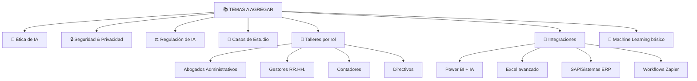
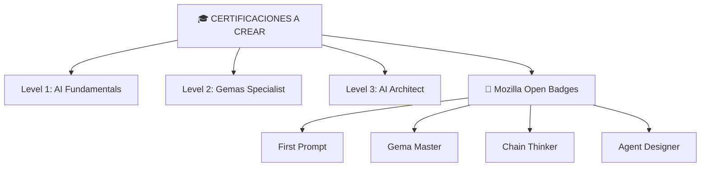

# 🗺️ Roadmap - Futura Evolución del Taller

> **Planificación de mejoras, extensiones y escalabilidad del taller a largo plazo.**

---

## 📊 Versión Actual: 1.0

**Estado:** MVP (Producto Mínimo Viable) completo y funcional  
**Cobertura:** 100+ documentos, 3 bloques, 25+ horas de contenido  
**Público:** Personal administrativo sin experiencia en IA  
**Formato:** Documentación Markdown + ejercicios prácticos  

---

## 🚀 Roadmap de Versiones

### ✅ V1.0 - Foundation (ACTUAL)
```
Estado: ✅ COMPLETADA (Julio 2026)
Alcance:
  - 100+ documentos Markdown
  - 3 bloques completos
  - Ejercicios prácticos en todos
  - Guías de educador
  - Sistema de evaluación
  - Material presencial listo
```

---

### 🟡 V1.1 - Polish & Optimize (Próximas 2 semanas)
```
Objetivo: Refinamiento post-primer taller
Cambios:
  - Feedback de alumnos reales integrado
  - Typos y errores lingüísticos corregidos
  - Ejemplos actualizados con casos reales
  - Videos cortos (5-10 min) para conceptos clave
  - Presentaciones MARP para cada bloque
  - Enlaces de recursos actualizados
  - FAQ expandida con preguntas nuevas

Entregas:
  - 5-10 videos de demostración
  - 3 presentaciones MARP (1 por bloque)
  - Documentación revisada
  - Casos de éxito locales incluidos
```

---

### 🟠 V2.0 - Digital Experience (Próximos 2 meses)
```
Objetivo: Plataforma interactiva online
Cambios:
  - Sitio web estático (Hugo/Jekyll)
  - Ejercicios interactivos (integración API ChatGPT)
  - Quiz automáticos con retroalimentación
  - Tracking de progreso de alumnos
  - Foro de estudiantes
  - Sistema de certificación digital

Tech Stack:
  - Frontend: Hugo/Next.js
  - Backend: Node.js o Python
  - Database: PostgreSQL
  - Hosting: Vercel/AWS/Azure

URL esperada: https://talleradipu.es o similar
```

---

### 🔴 V2.5 - AI-Powered Tutoring (3-4 meses)
```
Objetivo: Tutor de IA adaptativo
Cambios:
  - Chatbot tutor basado en Claude/GPT
  - Adaptación de dificultad según progreso
  - Generación dinámica de ejercicios
  - Evaluación automática de prompts
  - Feedback personalizado
  - Predicción de áreas donde alumno tiene dificultad

Capacidades:
  - "¿Puedes explicar esto diferente?"
  - "Dame un ejercicio más fácil/difícil"
  - Validación automática de Gemas
  - Sugerencias de mejora de prompts
```

---

### 🟣 V3.0 - Enterprise Platform (6+ meses)
```
Objetivo: Solución integral para organizaciones
Cambios:
  - Multi-tenant: cada institución su instancia
  - RBAC (roles y permisos)
  - Integración SSO (LDAP/SAML)
  - Reporting para administradores
  - Gestión de cohortes/grupos
  - Integraciones con sistemas administrativos

Target: Diputaciones, Municipios, Universidades
```

---

## 📚 Expansión de Contenido

### V1.x - Temas Adicionales (Próximas 4 semanas)



### V2.x - Certificaciones (3-6 meses)



---

## 🌍 Expansión Geográfica

### Fase 1: Diputación de Segovia (ACTUAL)
```
✅ Piloto completado
✅ Material adaptado a nivel local
✅ Educador capacitado
```

### Fase 2: Otras Diputaciones (Q3 2026)
```
OBJETIVO: Escalar a otras provincias españolas
Adaptaciones:
  - Ejemplos locales (normativa autonómica)
  - Casos reales de cada región
  - Contactos de administraciones locales
  - Capacitación de educadores regionales
```

### Fase 3: Instituciones Públicas Nacionales (Q4 2026)
```
OBJETIVO: Ministerios, CCAA, municipios grandes
Adaptaciones:
  - Niveles de complejidad variables
  - Contextos específicos de cada institución
  - Normativa nacional vs autonómica
```

### Fase 4: Europa (2027)
```
OBJETIVO: Traducción y adaptación europea
Idiomas: EN, FR, DE, IT, PT
Adaptación: GDPR, regulaciones locales
Formato: Modelo "open source" con licencia educativa
```

---

## 🎓 Modalidades Futuras

### Online Asincrónico (V2.0)
```
✅ Ya planeado
- Auto-estudio a ritmo propio
- Tutorías por video bajo demanda
- Comunidad global
```

### Presencial Certificado (V1.5)
```
🟡 En diseño
- Programas de 40 horas (~1-2 semanas)
- Certificado oficial
- Capacitación de "instructores certificados"
```

### Blended Híbrido (V2.5)
```
🟠 En exploración
- Parte presencial (2-3 días)
- Parte online (4 semanas)
- Mentoría 1-a-1
- Comunidad de práctica
```

### Bootcamp Intensivo (V2.0)
```
🔴 En concepto
- 1 semana, 40 horas
- Full-time
- Proyecto final implementado
- Empleo + Internships
```

---

## 👥 Públicos Meta Adicionales

### Educación (V1.5+)
```
TARGET: Universidades, escuelas profesionales
CONTENIDO:
  - Adaptación a FP/Grado
  - Proyectos más técnicos
  - Integración con curriculum
  - Profesor guía + plataforma
```

### Empresa Privada (V2.0+)
```
TARGET: Consultorías, tech companies
CONTENIDO:
  - Caso empresarial (productividad, ROI)
  - Integración con herramientas comerciales
  - Data science + IA
  - Escalabilidad
```

### Emprendimiento (V2.5+)
```
TARGET: Startups, pymes
CONTENIDO:
  - Cómo crear negocio con IA
  - Automatización de procesos
  - Growth hacking
  - Go-to-market strategy
```

---

## 💻 Mejoras Técnicas

### V1.1 - Infraestructura
```
- GitHub Pages para documentación
- Automated CI/CD (validar Markdown)
- Versioning con tags
- Releases automáticas
```

### V2.0 - Platform
```
- Sitio web responsive
- Búsqueda full-text
- Recomendación de rutas de aprendizaje
- Integración con Slack/Discord
```

### V3.0 - Escalabilidad
```
- Microservicios
- API REST completa
- Webhooks
- Integraciones con SSO
```

---

## 📊 Métricas de Éxito

### V1.0 (Actual)
```
✅ 100+ documentos creados
✅ 25+ horas de contenido
✅ 100% cobertura de 3 bloques
✅ Taller piloto listo
```

### V1.1
```
🎯 5+ alumnos por taller
🎯 8+/10 satisfacción
🎯 50% aplicando IA en trabajo
🎯 10+ videos producidos
```

### V2.0
```
🎯 100+ alumnos online
🎯 5+ idiomas
🎯 90%+ completion rate
🎯 1000+ certificados emitidos
```

### V3.0
```
🎯 10+ instituciones públicas usando
🎯 1000+ alumnos anuales
🎯 20+ Gemas creadas por usuario promedio
🎯 ROI medible (horas ahorradas)
```

---

## 💰 Modelo de Sostenibilidad

### Gratuito (Actual)
```
✅ Todo acceso libre
✅ GitHub open source
✅ Financiado por: Diputación Segovia
```

### Freemium (V2.0)
```
- Base gratuita (Bloque 1)
- Premium: Bloques 2-3, certificados, mentorías
- Educadores: Acceso gratuito + soporte
```

### Servicios (V2.5)
```
- Consultoría de implementación
- Diseño de Gemas a medida
- Capacitación corporativa
- Soporte técnico
```

---

## 🔒 Gobernanza & Comunidad

### Open Source
```
LICENSE: CC-BY-SA 4.0 (educativo)
CONTRIBUCIONES:
  - Educadores pueden enviar mejoras
  - Traducciones comunitarias
  - Casos de estudio de usuarios
```

### Comunidad
```
- Grupo Telegram/Discord
- Sesiones mensuales de Q&A vivo
- Showcase de proyectos
- Mentoría peer-to-peer
```

### Governance
```
- Comité asesor (2-3 personas)
- Roadmap transparente
- Votación de features nuevos
- Licencia de atribución
```

---

## 🎯 Hitos Críticos

```
2026 Julio    ✅ V1.0 - Foundation COMPLETA
2026 Agosto   🟡 V1.1 - Videos + Polish
2026 Oct      🟠 V2.0 - Plataforma online
2026 Dic      🔴 V2.5 - Tutor de IA adaptativo
2027 Mar      🟣 V3.0 - Enterprise Edition
2027 Dic      🎓 50+ instituciones usando
2028         🌍 Escala europea
```

---

## 📞 Feedback Loop

### Recolección de Datos
```
- Encuestas post-taller (Google Forms)
- Seguimiento de aplicación real (1 mes después)
- Entrevistas con educadores (mensual)
- Análisis de uso de plataforma (V2.0+)
```

### Iteración
```
- Sprint de mejoras mensuales
- Release notes públicos
- Changelog transparente
- Decisión de features basada en uso
```

---

## 🚨 Riesgos & Mitigación

### Riesgo: Tecnología cambia muy rápido
```
MITIGACIÓN:
- Mantener contenido agnóstico de herramientas
- Énfasis en conceptos, no en clicks
- Actualización trimestral de casos
- Comunidad que reporta cambios
```

### Riesgo: Bajo uso/demanda
```
MITIGACIÓN:
- Marketing activo en redes
- Demostraciones públicas
- Caso de éxito bien documentado
- ROI claro (horas ahorradas = dinero)
```

### Riesgo: Falta de educadores capacitados
```
MITIGACIÓN:
- Programa de "Certified Educators"
- Guía de entrenamiento detallada
- Comunidad de soporte entre educadores
- Incentivos (remuneración, reconocimiento)
```

---

## 🎁 Bonus: "Nice to Have"

```
Si el tiempo/presupuesto permite:

- Podcast "AI para Administración"
- YouTube channel con demos
- Newsletter semanal de tips
- Libro impreso (compilación de material)
- Conferencia anual de usuarios
- Hackathon anual (Gemas innovadoras)
- Competencia de prompts
- Mentoría con expertos de OpenAI/Anthropic
- Integración con Slack workspace
- Bot de Telegram con ejercicios diarios
```

---

## 🏁 Próximos Pasos Inmediatos

### Esta Semana
- [ ] Recopilar feedback del primer taller
- [ ] Documentar casos de éxito
- [ ] Crear lista de mejoras V1.1
- [ ] Planificar segundo taller

### Este Mes
- [ ] Registrar dominio (si es para público)
- [ ] Crear cuenta GitHub (si aún no)
- [ ] Empezar videos (5 minutos cada sección clave)
- [ ] Expandir FAQ con preguntas reales

### Este Trimestre
- [ ] Lanzar V1.1
- [ ] Capacitar 3-5 educadores más
- [ ] Escalar a 2 provincias
- [ ] Comenzar desarrollo V2.0

---

## 👋 Conclusión

Este taller es **el inicio de algo mayor:**

- ✅ Transformación digital en administración pública
- ✅ Democratización del conocimiento de IA
- ✅ Empoderamiento de personal administrativo
- ✅ Creación de comunidad de innovadores

**La pregunta no es "¿Conseguiremos lo que planeamos?"**

**La pregunta es "¿Cuán grande puede ser?"**

---

**Versión:** 1.0  
**Última actualización:** 2026-07-01  
**Licencia:** CC-BY-SA 4.0 (Educativo)  

🚀 **¡El futuro es ahora!**

