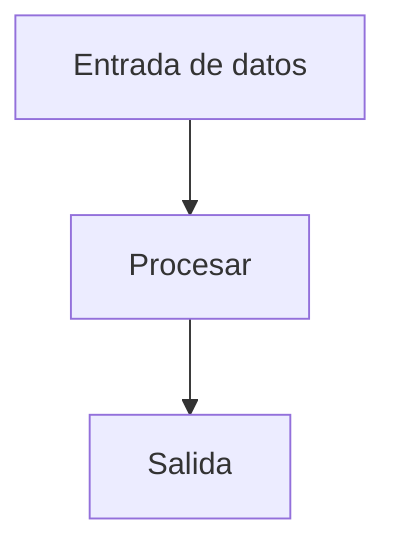

# ⚙️ SETUP: Prepárate para el Taller

Antes de empezar, necesitas tener lista tu **caja de herramientas**. No te preocupes: es muy sencillo y todo es **gratuito o tienes versiones gratuitas**.

---

## 🎯 Objetivo de esta página

En **5 minutos** tendrás todo listo para hacer tu primer prompt y empezar el taller.

---

## 📋 Checklist Rápido

Necesitas:

- ✅ Un navegador web (Chrome, Firefox, Edge, Safari)
- ✅ Una cuenta en ChatGPT O Claude (o ambas)
- ✅ Excel, Google Sheets o LibreOffice Calc
- ✅ Un correo electrónico válido
- ✅ 10 minutos libres

**Eso es todo. En serio.**

---

## 🛠️ Herramientas por Categoría

### 1️⃣ **Herramientas de IA Generativa** (REQUERIDO)

Necesitas **al menos una**. Te recomiendo tener las dos para comparar.

#### **ChatGPT** (OpenAI)
- 🌐 Acceso: https://chat.openai.com
- 💰 Plan gratuito: Sí, limitado
- 💰 Plan de pago: $20/mes (ChatGPT Plus)
- 📱 Aplicación móvil: Sí
- ⭐ Mejor para: Uso general, escritura

**Ventajas:**
- Muy intuitivo, perfecto para principiantes
- Excelente para redacción y análisis
- Comunidad grande con recursos

**Pasos para registrarse:**
1. Abre https://chat.openai.com
2. Haz clic en "Sign up"
3. Completa el formulario o usa Google/Microsoft
4. Verifica tu correo
5. ¡Listo!

---

#### **Claude** (Anthropic)
- 🌐 Acceso: https://claude.ai
- 💰 Plan gratuito: Sí
- 💰 Plan de pago: $20/mes (Claude Pro)
- 📱 Aplicación móvil: Sí (en desarrollo)
- ⭐ Mejor para: Análisis técnico, código, documentos largos

**Ventajas:**
- Mejor para análisis de datos complejos
- Mejor con archivos y documentos largos
- Muy útil para tareas administrativas

**Pasos para registrarse:**
1. Abre https://claude.ai
2. Haz clic en "Sign up"
3. Completa el formulario
4. Verifica tu correo
5. ¡Listo!

---

#### **Google Gemini** (Alternativa)
- 🌐 Acceso: https://gemini.google.com
- 💰 Plan gratuito: Sí
- 💰 Plan de pago: Incluido en Google One (2€/mes)
- ⭐ Mejor para: Búsqueda integrada, Google Workspace

---

### 2️⃣ **Hojas de Cálculo** (REQUERIDO)

Necesitas **al menos una** para los ejercicios de Excel.

#### **Microsoft Excel**
- 💰 Precio: Incluido en Microsoft 365 (69€/año personal)
- 🌐 Versión web: Gratuita con cuenta Hotmail
- 📱 Aplicación: Sí
- ⭐ Mejor para: Administración profesional

---

#### **Google Sheets** (Recomendado - GRATUITO)
- 🌐 Acceso: https://sheets.google.com
- 💰 Precio: GRATUITO
- 📱 Aplicación: Sí
- ⭐ Mejor para: Colaboración, acceso desde cualquier lugar

**Ventaja**: Funciona igual que Excel para el 95% de lo que haremos.

---

#### **LibreOffice Calc** (Alternativa - GRATUITO)
- 🌐 Descarga: https://www.libreoffice.org/
- 💰 Precio: GRATUITO
- 📱 Aplicación: No (escritorio)
- ⭐ Mejor para: Usuarios de Linux

---

### 3️⃣ **Navegador Web** (REQUERIDO)

Probablemente ya lo tienes. Asegúrate de que esté actualizado.

**Recomendaciones:**
- ✅ Google Chrome (mejor compatibilidad)
- ✅ Mozilla Firefox (privacidad)
- ✅ Microsoft Edge (integración con Windows)
- ⚠️ Safari (limitaciones con algunas herramientas)

**Cómo actualizar:**
- Chrome: Menú → Configuración → Acerca de Chrome
- Firefox: Menú → Ayuda → Acerca de Firefox
- Edge: Menú → Configuración → Acerca de

---

### 4️⃣ **Extras Recomendados** (OPCIONAL)

#### **Notion**
- 🌐 Acceso: https://www.notion.so
- 💰 Plan gratuito: Muy completo
- ⭐ Uso: Tomar notas, organizar contenido

#### **Microsoft OneNote**
- 💰 Gratuito con cuenta Hotmail
- ⭐ Uso: Tomar notas colaborativas

---

## 📄 Un Detalle Importante: Formatos de Texto

### El Problema: WYSIWYG vs Markdown

Probablemente trabajas con documentos en **Word, PDF, Google Docs**. Estos usan formato [**WYSIWYG**](https://en.wikipedia.org/wiki/WYSIWYG) (What You See Is What You Get).

**¿Por qué importa?**

| Aspecto | WYSIWYG (Word, PDF) | Markdown |
|--------|----------|----------|
| Datos | 5% contenido, 95% formato | 99% contenido, 1% formato |
| Tamaño de archivo | Grande | Muy pequeño |
| IA lo entiende | Difícil (mucho "ruido") | Fácil (texto puro) |
| Ejemplo | `<font color="blue" size="14">Hola</font>` | `Hola` |

**En términos de IA:**
- Word/PDF: "Lee un documento con colores, márgenes, fuentes..."
- Markdown: "Lee solo el contenido puro"

### Solución: Markdown (y Mermaid)

**Markdown** es un formato simple que entiende mejor la IA:

```markdown
# Título Principal

## Subtítulo

- Punto 1
- Punto 2

**Texto en negrita** y *texto en cursiva*

```código aquí```
```

**¿Dónde lo ves?**
- ✅ **Este taller está escrito en Markdown** (README.md, SETUP.md, todos los documentos)
- ✅ GitHub muestra perfectamente Markdown
- ✅ La IA lo procesa 100 veces más rápido que PDF

**Bonus: Mermaid para Diagramas**

Si necesitas diagramas, en lugar de insertar imágenes (que pesan mucho), usa **Mermaid**:



Markdown convierte ese código en un diagrama automáticamente.

### 💡 Consejo Práctico

Cuando compartas documentos con la IA, **evita PDF o Word**, usa:
- ✅ Copiar/pegar el texto directamente
- ✅ Subir archivos en Markdown (.md)
- ✅ Usar Google Sheets (mejor que Excel binario)

**Resultado:** Respuestas más rápidas, precisas y eficientes de la IA.

---

## 🎯 Tu Primer Descubrimiento: "Prompt 0"

Antes de hacer prompts "serios", vamos a hacer un **experimento** para entender algo fundamental sobre la IA:

### 💡 El Concepto: "Cada respuesta es única"

La IA NO funciona como una calculadora (que siempre da el mismo resultado). Cada vez que preguntas, puede dar una respuesta **ligeramente diferente**. Esto es una **característica**, no un error.

### 🔬 El Experimento

**Paso 1: Abre Google Gemini** (herramienta por defecto en la Diputación)
- Entra en https://gemini.google.com
- Inicia sesión con tu cuenta Google (la del trabajo si la tienes)

> 📌 **¿Por qué Gemini?** En la Diputación de Segovia se usa Gemini por defecto (integración con Google Workspace, RGPD, datos en servidores españoles). Durante el taller usaremos principalmente Gemini, aunque los ejercicios funcionan en ChatGPT y Claude.

**Paso 2: Haz esta pregunta**
```text
¿Quiénes fueron los Comuneros de Castilla? 
Resume en 3-4 párrafos.
```

**Paso 3: Copia la respuesta** (guárdala en el portapapeles o en un documento)

**Paso 4: Haz la MISMA pregunta de nuevo**
Verás que la respuesta es **LIGERAMENTE DISTINTA**. Las ideas principales son iguales, pero el orden, los énfasis, los ejemplos... son diferentes.

**Paso 5: Compara con un compañero**
- Pídele que haga la misma pregunta en Gemini
- Compara su respuesta con la tuya
- **Descubrirás que son distintas**

### 🤔 ¿Por Qué Sucede Esto?

La IA tiene un parámetro llamado "temperatura" que controla la creatividad/variabilidad. Es como:
- **Baja temperatura**: Siempre respuestas similares (calculadora)
- **Alta temperatura**: Respuestas muy distintas (poeta creativo)

Los mejores resultados están en el medio.

### ✅ Lo Que Has Aprendido

Con este simple experimento, ya entiendes:
- ✅ Que la IA no es determinística
- ✅ Que cada persona obtiene resultados distintos (¡esto es normal!)
- ✅ Que Gemini es la herramienta de la Diputación
- ✅ Que puedes hacer preguntas directas

---

## 🚀 Tu Primer Prompt "Serio" en 2 Minutos

¡Ahora sí, vamos a hacer tu **primer prompt estructurado**!

### Paso 1: Sigue en Gemini
Ya tienes Gemini abierto del experimento anterior. Bien.

### Paso 2: Escribe este prompt
```text
Soy empleado/a administrativo/a de una diputación provincial.
Necesito ayuda para mejorar mi eficiencia con herramientas de IA.

Antes de responderme, hazme 3 preguntas que te ayuden a entender 
mejor qué tipo de tareas hago a diario.
```

### Paso 3: Presiona Enter
Mira qué preguntas te hace la IA. Son preguntas **inteligentes** que te ayudarán a tener una conversación más productiva.

### Paso 4: Continúa la conversación
Responde basándote en tu trabajo real. No necesitas ser preciso: "datos de subvenciones", "expedientes administrativos", "comunicaciones con ciudadanos"...

---

## ⚡ Tu Primer "Éxito"

Cuando hayas hecho esos pasos, **habrás experimentado**:

✅ Cómo registrarte en una plataforma de IA  
✅ Cómo escribir un prompt  
✅ Cómo la IA mejora con información adicional  
✅ Cómo mantener una conversación con IA  

**Eso es exactamente lo que aprenderás en profundidad en el Bloque 1.**

---

## 🎓 Configuración Recomendada para el Taller

### **Opción 1: Minimalista (Recomendado para principiantes)**

Necesitas solo 3 cosas:
1. ✅ ChatGPT (registrado)
2. ✅ Google Sheets (acceso web)
3. ✅ Este repositorio (descargado o accesible)

**Ventaja:** Simplicidad, todo en la nube, fácil de seguir

---

### **Opción 2: Completa (Recomendado si tienes tiempo)**

1. ✅ ChatGPT (registrado)
2. ✅ Claude (registrado)
3. ✅ Google Sheets + Excel (comparar comportamientos)
4. ✅ LibreOffice Calc (alternativa)
5. ✅ Este repositorio + notebook local

**Ventaja:** Compara herramientas, más aprendizaje

---

## ❓ Problemas Comunes

### "No puedo registrarme en ChatGPT"

**Soluciones:**
1. Intenta con un correo diferente
2. Usa Google Sign-in si tienes cuenta Google
3. Intenta Claude (https://claude.ai) como alternativa
4. Verifica que tu navegador acepta cookies

### "¿Necesito pagar para empezar?"

**No.** Las versiones gratuitas tienen todo lo que necesitas para este taller. Los límites de uso son generosos.

### "¿Puedo hacer el taller sin Excel?"

**Sí.** Google Sheets funciona igual. De hecho, para este taller es suficiente.

### "Mi navegador no funciona con ChatGPT"

**Soluciones:**
1. Intenta con Edge o Chrome
2. Limpia el caché (Ctrl+Shift+Supr)
3. Desactiva extensiones del navegador
4. Usa una ventana de navegación privada

### "¿Puedo usar otra herramienta de IA?"

**Sí.** También funcionan:
- Google Gemini
- Hugging Face
- Perplexity AI
- Cohere

Pero recomiendo ChatGPT o Claude para este taller.

---

## 🔒 Seguridad y Privacidad

### **Datos que NO debes compartir con IA**

❌ Contraseñas  
❌ Números de DNI/NIF  
❌ Datos bancarios  
❌ Información confidencial de la Diputación  
❌ Datos personales de ciudadanos  

### **Datos que SÍ puedes compartir**

✅ Procesos generales (sin detalles sensibles)  
✅ Plantillas públicas  
✅ Ejemplos anonimizados  
✅ Documentación pública  

### **Consejo**

Siempre usa **términos generales**. En lugar de:
```text
Necesito redactar una orden para el departamento de XYZ 
sobre el expediente de Juan García que vive en...
```

Usa:
```text
¿Cómo redacto una orden administrativa genérica 
sobre expedientes?
```

---

## 📱 Descargar Este Repositorio

### **Opción 1: Como carpeta (recomendado)**

1. Baja a la página principal del repositorio
2. Haz clic en `Code` (verde)
3. Selecciona `Download ZIP`
4. Extrae en tu carpeta de Descargas o Documentos

### **Opción 2: Acceso web**

1. Abre el repositorio en GitHub
2. Navega por los documentos directamente
3. (Necesitas conexión a internet)

---

## 🎯 Próximo Paso

Una vez hayas completado este SETUP:

1. ✅ Abre [`01-IA-Generativa/README.md`](../01-IA-Generativa/README.md)
2. ✅ Comienza por el primer documento
3. ✅ Sigue el ritmo del taller
4. ✅ Realiza cada ejercicio

---

## ✨ ¡Estás Listo!

Todo está configurado. **Ahora viene la parte divertida.**

No tengas miedo de experimentar, cometer errores o hacer preguntas raras a la IA. Es precisamente lo que debe ocurrir cuando estás aprendiendo.

**Adelante, ¡que comience la aventura!** 🚀

